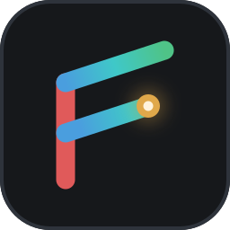



# Flyback

[](https://github.com/markovcd/Flyback/actions/workflows/ci.yml)
[](https://github.com/markovcd/Flyback/actions/workflows/site.yml)

Flyback is a patchable synthesiser for .NET 10. One graph can generate both a picture and a sound. The visual path and the audio path share the same module graph and are compiled down to the same flat instruction stream.

The [website](https://markovcd.github.io/Flyback/) has screenshots, tutorials and the plugin guide. See [CHANGELOG.md](CHANGELOG.md) for what changed in each release, and the [releases page](https://github.com/markovcd/Flyback/releases) for downloads.

## The premise

Flyback is mostly written by a large language model (LLM). A human directs the work, decides what ships and writes some of it by hand. That is how the project happens to be made, not a requirement on anyone who works on it.

The project holds to the same standards any modern codebase would: a CI gate that restores, compiles and runs the whole test suite on every push and pull request, signed releases built from the same image the gate stops inside, architecture decisions recorded in `docs/adr/`, and a changelog per release. Nothing merges that the gate has not passed.

Tokens are the one thing the project spends money on, and a donation goes on that budget. Flyback is strictly non-profit: nothing in it is sold, nothing is behind a payment, and nobody is paid out of it. The address is in About and in the site's footer.

[CONTRIBUTING.md](CONTRIBUTING.md) is how to work in it.

## Quick start

```bash
dotnet run --project src/Flyback.Editor.Desktop -c Release
```

## Features

- Visual patch editor for building synth graphs by wiring modules together
- One patch generates both a picture and a sound from the same graph
- Per-pixel signal synthesis driven by coordinates and time
- Normalled sockets so common sources such as time and coordinates are present by default
- Feedback and iterative image generation via feedback modules and previous-frame sampling
- Sources, oscillators, patterns, forms, geometry, color, maths, pitch, timing, shaping, time effects, feedback and measurement modules, with presets for each
- Live preview, output settings and live recording in the app shell; deterministic export through the CLI
- MP4, WebM, MOV, MP3, M4A and FLAC through ffmpeg where it is installed, found on `PATH` or picked by hand; Motion JPEG AVI and WAV are written by Flyback itself and need nothing
- MIDI input support through platform backends (Windows, macOS and Linux)
- CLI tools for rendering, checking, inspecting and bundling patches
- A text language a patch can be written in, saved as and read back from — the same instrument, as source
- A viewer that opens a patch and plays it at once, picture and sound, with no editor and nothing written
- A web viewer that plays a patch in a browser, on the same engine compiled to WebAssembly
- Plugin-based architecture for platform-specific audio/video backends and extensions
- Patch bundles that package the patch with its referenced sample and image files
- Agentic patch authoring through a model-backed assistant that can listen, propose changes and work inside the same patch graph — over any chat-completions endpoint, or over Gemini, whose models hear the patch themselves
- Cross-platform publish targets for Windows, macOS and Linux
- Updates itself from signed GitHub releases: downloads a new release in the background and installs it at the next start (Settings → Privacy to turn off)
- Counts how it is used — version, operating system, plugins and sound backend, the rough size of the machine, the kinds of module in a patch that plays, which assistant is asked, how long a run lasts and what it did, and where it crashed — anonymously, in coarse bands, and with nothing about any patch in it (Settings → Privacy to turn off)

## Build and publish

The solution builds the web editor, which needs the wasm-tools workload:

```bash
dotnet workload install wasm-tools
```

```bash
dotnet publish src/Flyback.Editor.Desktop -c Release -r win-x64 -o artifacts/win-x64
dotnet publish src/Flyback.Cli -c Release -r win-x64 -o artifacts/win-x64
dotnet publish src/Flyback.Viewer.Desktop -c Release -r win-x64 -o artifacts/win-x64
```

This produces a self-contained folder with the app, the CLI and the viewer, plus the shared runtime and plugin folders:

```text
Flyback.exe          the app
flyback-cli.exe      the command line tool
flyback-viewer.exe   the viewer: opens a patch and plays it, and writes nothing
Flyback.Core.dll     the patch model and the module API, which plugins are built against
Flyback.Engine.dll   the compiler, the language and the renderers
Flyback.Plugins.dll  shared plugin host
plugins/             platform backends, and the Picture, Voice, Effects and Mastering modules
```

Supported publish targets include:

- `win-x64`
- `win-arm64`
- `osx-x64`
- `osx-arm64`
- `linux-x64`

macOS bundles are published as `Flyback.app` beside the output folder, whose `Info.plist` declares `.fbk`, `.fbkb` and `.fbks`. On Windows and Linux, Settings → Files registers the editor or the viewer to open them, for the current user.

## Docker builds

```bash
docker build --output artifacts .
```

This restores dependencies, compiles the solution, runs the tests, and publishes the self-contained outputs for the default target set.

To choose a specific set of runtimes:

```bash
docker build --build-arg RIDS="win-x64 win-arm64 osx-arm64 osx-x64 linux-x64" --output artifacts .
```

To restore, compile and run the whole test suite without publishing anything, which is what the Build workflow (`.github/workflows/ci.yml`) does on every push and pull request:

```bash
docker build --target gate .
```

To measure how much of the code the tests run, into `coverage/` with a table per assembly in `coverage/summary.md` and the specs' figure beside it rather than in the sum, the same way the weekly Coverage workflow does:

```bash
./scripts/coverage.sh
```

To find out whether a change made anything faster or slower, measured against the commit before it on this machine, benchmarks and the web viewer's sound alike, with a change called only where the difference is real:

```bash
./scripts/bench-compare.sh HEAD~1 HEAD --filter '*AudioBenchmarks*' --web "Whole band"
```

## Releases and updates

The Release workflow (`.github/workflows/release.yml`) builds every platform, zips each one, and publishes them with a `SHA256SUMS` file and its signature, `SHA256SUMS.sig`. The app only installs an update when that signature checks out against the public key in `src/Flyback.Editor/Updates/release-key.pem`. The private key is kept in the repository secret `RELEASE_SIGNING_KEY`, and the workflow fails before it builds anything if the secret is missing or doesn't match the committed public key. It also fails before building if `CHANGELOG.md` has no `## X.Y.Z` heading for the version being released, since that heading is what the "What's new" window reads. [ADR-0088](docs/adr/0088-a-release-installs-itself-at-the-next-start.md) explains the design. The same key signs the packages of the plugins the preset site starts with and hands out, Figures, Fractals and Easy among them, which no release carries ([ADR-0141](docs/adr/0141-the-preset-site-starts-with-a-plugin-its-build-packs-and-the-release-key-signs.md)).

Everything but the publishing is `release.sh`, which runs the same here:

```bash
./scripts/release.sh 1.4.0
```

It builds, tests, packs and signs into `dist/`, with each platform as a folder to run rather than a zip, and publishes nothing. Off GitHub, `RELEASE_SIGNING_KEY` holds a local test key rather than the release key: `release-key.sh` takes it from the environment, or makes one and keeps it in the user environment, and only GitHub stops at a key that does not pair with the committed public key or at a missing changelog heading. The preset site's build and a Release run of the site sign with the same variable, and a Debug build checks no keys at all. A build on this machine, `release.sh` included, embeds the public half of the local key in place of `release-key.pem`, so a local release installs over local builds, and its runs count as debug in the usage statistics; on GitHub the committed key is embedded.

To make the key pair, with the `openssl` that comes with Git Bash:

```bash
openssl genpkey -algorithm EC -pkeyopt ec_paramgen_curve:P-256 -out flyback-release.key
```

```bash
openssl pkey -in flyback-release.key -pubout -out src/Flyback.Editor/Updates/release-key.pem
```

Commit the public key. Paste the whole contents of `flyback-release.key` into the `RELEASE_SIGNING_KEY` secret, keep a copy somewhere safe such as a password manager, and then delete the file. Never commit it. Installed copies only accept releases signed with the key they were built with, so a lost key means everyone installs the next release by hand.

## CLI

The CLI runs the same engine without the Avalonia shell, so it is useful for rendering, checking and batch jobs.

```bash
flyback-cli render nebula.fbk -o nebula.png --size 1920x1080 --at 2.5
flyback-cli render drone.fbk -o drone.mp4 --seconds 30 --fps 30
flyback-cli render drone.fbk -o drone.avi --seconds 30 --fps 30
flyback-cli render drone.fbk -o drone.mp3 --seconds 30
flyback-cli render drone.fbk -o drone.wav --seconds 30
flyback-cli render drone.fbk -o drone.wav --seconds 30 --loudness
flyback-cli render drone.fbk -o drone.mkv --seconds 30 --format mp4 --ffmpeg /opt/bin/ffmpeg
flyback-cli check nebula.fbk
flyback-cli check nebula.fbk --strict
flyback-cli check --preset "Mycelium" --json
flyback-cli compare nebula.fbk nebula-ported.fbk --seconds 30
flyback-cli info nebula.fbk
flyback-cli info --preset "Plasma"
flyback-cli modules
flyback-cli modules adsr
flyback-cli pack nebula.fbk -o nebula.fbkb
flyback-cli pack --preset "Mycelium" -o mycelium.fbkb
flyback-cli pack-plugin Flyback.Plugins.Ripple.csproj -o ripple.fbkp --key ripple.key
flyback-cli plugin-key -o ripple.key
flyback-cli print nebula.fbk -o nebula.fbks
flyback-cli print nebula.fbk --check
flyback-cli print --preset "Whole band"
flyback-cli render nebula.fbks -o nebula.png
flyback-cli save --preset "Acid" -o acid.fbk
flyback-cli save nebula.fbk -o nebula.fbks
flyback-cli probe --keys
flyback-cli shot --preset "Flyback Theme" -o theme.png --at 30.3 --select "Picture: Scope"
flyback-cli probe --provider all
flyback-cli ask drone.fbk "slower, and warmer"
flyback-cli ask --preset "Plasma" -o plasma.fbkb --model gpt-4.1 "make it blue"
flyback-cli viewer nebula.fbk
```

### Commands

`render`, `check`, `info`, `print`, `pack`, `save` and `shot` read a patch file, or a shipped or plugin preset named with `--preset` in its place; `--presets` lists the names, as a JSON array under `--json`, and a name nobody shipped is refused with the list.

- `render`: renders a still, a clip or a sound file from a patch. The extension picks the format — `.png`, `.avi`, `.mp4`, `.webm`, `.mov`, `.wav`, `.mp3`, `.m4a`, `.flac` — and everything but `.png`, `.avi` and `.wav` is encoded by ffmpeg, taken from `PATH` unless `--ffmpeg` names one. `--format` overrides the extension, and `--loudness` prints how loud the sound came out: integrated loudness in LUFS and true peak in dBTP, measured as ITU-R BS.1770 does. The picture is drawn on the GPU through a headless OpenGL context (EGL on Linux, WGL on Windows) where there is one, and on the processor where there is not; `--processor` asks for the processor, whose picture is exact to the bit, and `--gpu` fails rather than fall back. On the processor the patch runs compiled; `--interpreted` keeps it on the interpreter, which writes the same bytes more slowly.
- `check`: compiles the patch and reports issues; for a text patch, `--json` gives each complaint's line, column and a stable `code`
- `info`: shows module and wire counts and compile cost; `--preset` describes a shipped preset by name, and `--presets` lists them
- `pack`: packs a patch together with the files it references; `--preset` packs a shipped preset with the files it carries
- `pack-plugin`: builds a plugin into a `.fbkp`, signed with the key `--key` names
- `plugin-key`: makes the key a plugin's packages are signed with, which every update must be signed with too
- `shot`: draws the editor's window with the patch open into a PNG, with no screen and no sound: `--at` is the second the picture is of, run up to from a second and a half before; `--size` is the window's, 1440x900 unless given; `--select` selects a box or module by name, so the inspector shows it; `--canvas` shows the canvas for a patch whose text is the document; `--crop` writes only the canvas around the modules, with 24 pixels of room. `Flyback --shot`, beside it, does the drawing (ADR-0166)
- `viewer`: starts `flyback-viewer` with everything after the word, so `flyback-cli viewer --help` is the viewer's own help
- `print`: writes the patch out as text in the language, and can check that the text builds back to the same program; `--preset` prints a shipped preset by name, and `--presets` lists them
- `save`: saves the patch as the file `--out`'s extension names: `.fbk`, `.fbks` or `.fbkb`; `--preset` saves a shipped preset as a patch to open and change. A preset that plays recordings it carries saved as `.fbk` or `.fbks` is written, and exits `1` saying `.fbkb` would take them along
- `compare`: plays two patches side by side for `--seconds` at `--size` and says whether they are the same instrument, sample for sample and pixel for pixel, and where they first part when they are not; it exits `1` when they differ
- `modules`: lists the modules this build has, and which plugin defines each; given one by type id or name, it describes that module: each socket's default and range, where `|>` lands, what it carries besides its sockets and what it does
- `probe`: asks an assistant which models it has and what each one accepts
- `ask`: asks the assistant the editor is set to about a patch, and writes its answer back into the file with the conversation, where the next `ask` and the editor carry it on: inside a `.fbkb`, beside a `.fbk` or `.fbks`. A file that does not exist yet starts empty, and `--out` writes elsewhere. With no message it reads one from standard input, or asks line by line at a terminal. `--provider`, `--model` and `--set key=value` change the settings for one run, `--fresh` starts a new conversation, `--seen` keeps every picture it looked at and sound it heard, `--briefing` prints what it is handed, and `--json` writes one object a line, each tool call and its arguments included. Each turn ends with what it cost: its requests, the tokens they sent, had cached and wrote, and any time spent waiting out a rate limit. It exits `2` when a turn fails
- `stills`: draws a still of every preset into `--out`, with the `index.json` the galleries show them by in place of drawing them (ADR-0163); `./scripts/stills.sh <folder>` lays out the plugins a build ships first, and every release and site build runs it

`check` exits with:

- `0`: no errors
- `1`: patch errors
- `2`: the job could not run

`--strict` makes a warning fail as well. `check`, `compare`, `info`, `pack`, `modules`,
`probe` and `ask` each take `--json`, which writes the same answer as a document instead of
as prose.

`info` says what a patch requires and `modules` says what is installed to meet
it, which is the pair to reach for when a patch reports that it did not load
completely.

`probe` and `ask` are the commands that reach off the machine, and the provider bills both. `probe` asks a provider's endpoint what it
offers and records the answer in the settings file both programs read, so the app's model box
fills itself in without being told. It takes minutes and the provider bills for it, so it says
what that means and waits for a yes; `--yes` answers for a script, which has nobody to ask.
`--keys` says where each key would come from and asks nothing of anybody, and `--dry-run` prints
what was found and leaves the settings alone.

Settings → Assistant runs the same survey from a button, about the one model the form is set to.
It goes out with the provider, the form and the key as they stand on the settings window rather
than with what was last saved, which is how a model, a key or an endpoint can be tried before
any of them is kept. What it finds is written over that model's line in the list this command
left; filling the list is the command's job, since only it asks about every model.

### Completion

The CLI answers the `[suggest]` directive, which is the protocol `dotnet-suggest`
speaks:

```bash
flyback-cli "[suggest:13]" "flyback-cli pr"   # print, probe
```

So installing that tool and adding its shim to your shell gives completion of
commands, options and file arguments.

## Bundles

Flyback uses three file types:

- `.fbk`: a patch document
- `.fbkb`: a patch bundle containing the patch plus all referenced files
- `.fbks`: the patch written as text, in the language

```bash
flyback-cli pack nebula.fbk -o nebula.fbkb
```

A bundle is a zip archive with the patch and any sample/picture files it uses. It is readable by standard tools and does not require unpacking to render.

The app saves and opens all three. A `.fbks` is a copy rather than a document: it keeps the instrument exactly — the text builds back to the same program, op for op — but not the groups or the canvas layout, so saving one leaves the open document as it was.

## Viewer

`flyback-viewer` opens a patch and plays it, picture and sound, with no editor around it. It writes nothing — no settings, layout, recovery file or statistics — and takes its defaults from the same `settings.json` the editor saves, every one of them overridable on the command line.

```bash
flyback-viewer nebula.fbk
flyback-viewer --preset "No Sense Dub" --size 1080p --mute
flyback-viewer drone.fbk --from 30 --cpu --for 10
flyback-viewer --preset "Whole band" --hidden --for 10
flyback-viewer --help
```

Hover the top middle of the window for the transport: pause, rewind, the seek bar, loop and sound, with the knobs at the bottom (`--transport bottom` swaps them); double-click the picture for full screen. A patch with no picture, or a run with `--no-video`, opens as just the transport and its knobs. A patch that does not say its length has no seek bar or loop, and plays on. Space, or Ctrl+P, pauses. `--background` opens the window without taking focus, and `--hidden` opens none at all.

A patch made to be played is played here too: the computer's keys are notes wherever the patch reads them, a MIDI In hears the device it names, and a panel knob bound to a MIDI controller follows it. There is no knob panel, so a knob with no controller stays where the patch left it.

## Web viewer

`src/Flyback.Viewer.Web` plays a patch in a browser: the engine and the module plugins compiled to WebAssembly, the picture drawn on WebGL 2 by the desktop's own GPU renderer. It opens a shipped preset or a `.fbk`, `.fbkb` or `.fbks` dropped on it, and plays it; nothing else. The sound runs as JavaScript written from the patch, the heaviest showcase presets with a fifth of real time to spare; a patch whose sound still cannot keep up plays its picture alone and says how slow (ADR-0160).

```bash
dotnet publish src/Flyback.Viewer.Web -c Release -p:RunAOTCompilation=true -o artifacts/web
```

The preset site serves it at `/viewer/`, and each preset's page has a Play in your browser button that opens it there. On its own, serve `artifacts/web/wwwroot` from any static server and open `/viewer/`; `?preset=Nebula`, `?file=<url>` (with `&name=` where the URL does not end in the file's name, `&title=` for the name shown and `&back=` for the page to return to), `?size=1280x720`, `?loop` and `?mute` pick what opens and how. It offers no presets of its own: the presets page, on the preset site and on GitHub Pages, lists the shipped ones from the build's stills (ADR-0163) and sends one here, and the header leads back to `&back=`, or to the presets page. Space plays and pauses, left and right seek five seconds, up and down set the volume, M mutes and F goes full screen. A patch's panel knobs stand beside the picture, dragged up or right to turn and double-clicked to put back; on a phone they sit in a sheet under it, with keys on the screen for a patch played on the keyboard. A patch played on the computer keyboard takes its keys as the editor does, as a piano or in the patch's scale, with PageUp and PageDown moving the octave; its note keys win over the shortcuts. The AOT switch needs `dotnet workload install wasm-tools`; without it the page around the sound runs interpreted, at under half the speed. `window.flyback` drives the page from a script: `presets()`, `open`, `play`, `pause`, `seek`, `size(width, height)`, `volume(level)`, `knobs()`, `turn(knob, value)`, `strike(note, down)`, `release()`, `panel(pixels)`, the phone's sheet's height, `tab(name)`, its tab, `status()`, `still(seconds)`, the frame as a PNG at the patch's size, and `edit()`, Edit it: back to the web editor that sent the patch, or the patch opened in the web editor.

The sound runs without a page under Node, which the workload brings; `--knob fog=0` turns a panel knob first, `--note 60:0.1:0.6` holds a note on the computer keyboard from one second to another, and `--presets` lists the presets:

```bash
node artifacts/web/hear.mjs --preset "Sidebands" --seconds 2 --out sidebands.f32
```

## Web editor

`src/Flyback.Editor.Web` is the editor itself in a browser: the same window under Avalonia.Browser, the picture drawn on a canvas of its own by the desktop's GPU renderer (ADR-0162). It keeps nothing between visits, carries every plugin that makes modules, as the viewer does, and plays its sound in the web viewer's worker. The Flyback mark first on its toolbar goes back to the site, and the browser asks before the page is left with an edit on it. The presets page's Edit opens a preset in it, a shipped one by `?preset=<name>` and a shared one by `?file=<url>` (with `&name=` and `&title=` as the viewer takes them). The preset site serves it at `/editor/`; `-p:EditorWeb=false` builds the site without it:

```bash
dotnet run --project src/Flyback.Server
```

The gallery shows the build's stills from `/stills/` where the site has them (ADR-0163), and draws each preset on the page's one thread where it does not; `./scripts/stills.sh src/Flyback.Server/wwwroot/stills` gives a local run of the site the stills.

`window.flyback` drives the page from a script: `state()` says which preset is open, how many modules and wires it has, which renderer draws the picture and at what rate, and the last thing the editor said; `preset(name)` opens a shipped preset, as `/editor/?preset=<name>` does on load; `openUrl(url, fileName, title)` fetches a shared one and opens it, as `?file=` does, answering null or why it could not; `text()` reads the open patch in the language; `apply(text)` applies text as the text view's Apply does, one edit that one undo takes back, and answers null or what is wrong with it; `sound()` says how the sound is going; `view()` presses View it, which opens the patch as it stands in the web viewer in a tab of its own, and answers the viewer's address, or null where the browser refused the tab.

`./scripts/pages.sh artifacts/pages` builds the site as GitHub Pages serves it, the viewer, the editor and the stills built in, and the `pages` entry in `.claude/launch.json` serves that folder; `AOT=false` makes it quicker.

## How it works

A patch is a graph, but during rendering it is compiled into a flat straight-line program over registers. Unused sections are not compiled, and the inner loop is designed to be cheap and predictable.

The project is split roughly as:

```text
src/
  Flyback.Editor.Desktop the editor on the desktop
  Flyback.Editor         the editor itself: its window, canvas and regions
  Flyback.Cli            command line tool
  Flyback.Core           patch model, module API and the built-in modules
  Flyback.Engine         compiler, text language, renderers and file formats
  Flyback.Plugins        plugin host and built-in plugin logic
  Flyback.Ui             the preview, sound device and look the app and the viewer share
  Flyback.Viewer.Desktop the viewer: opens a patch and plays it
  Flyback.Viewer.Web     the web viewer: the same, in a browser
  Flyback.Editor.Web     the web editor: the editor in a browser

tests/
  Flyback.Core.Tests            core engine tests
  Flyback.Specs                 feature requirements as Gherkin scenarios
  Flyback.Core.Benchmarks       engine benchmarks
  Flyback.Editor.Tests          editor tests, headless Avalonia
  Flyback.Viewer.Desktop.Tests  viewer window tests
  Flyback.Editor.Desktop.Tests  desktop shell tests
  Flyback.Ui.Tests              shared control, audio and MIDI tests
  Flyback.Ui.Testing            the headless test harness (not a test project)
  Flyback.Cli.Tests             command line tests
  Flyback.Plugins.Tests         plugin and runtime behavior tests
  Flyback.Plugins.OpenAi.Tests  chat-completions session tests
  Flyback.Plugins.Gemini.Tests  generateContent session tests
```

[`docs/engineering-guide.md`](docs/engineering-guide.md) is how the codebase is put together, how its code is written and how its tests are written. See the `docs/adr` folder for the architecture decisions behind it.

[`docs/language.md`](docs/language.md) is the reference for the text language — a
second way to author a patch, decided in
[ADR-0065](docs/adr/0065-a-text-language-that-parses-to-a-patch.md). The app
saves and opens it, the CLI reads it wherever it reads a patch and writes one with `print`, and the
assistant writes a whole patch in one call with it.
