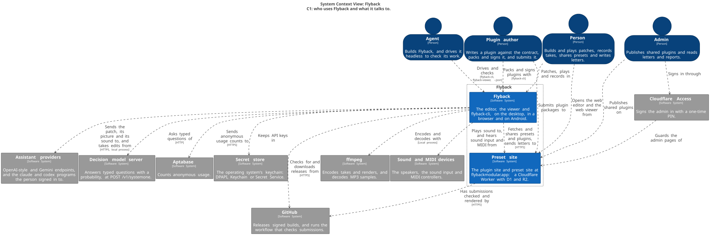

# Diagrams

Flyback's [C4 model](https://c4model.com) is [`workspace.dsl`](workspace.dsl), in
[Structurizr DSL](https://docs.structurizr.com/dsl) (ADR-0189). Each view in it is
drawn to an SVG here, committed beside the model.

| View | Level | Shows |
|---|---|---|
| [`context.svg`](context.svg) | C1, system context | Who uses Flyback, and what it talks to |



After changing the model, redraw and commit both:

```sh
./scripts/diagrams.sh
```

It needs only Docker, and fails on a model that does not validate.
