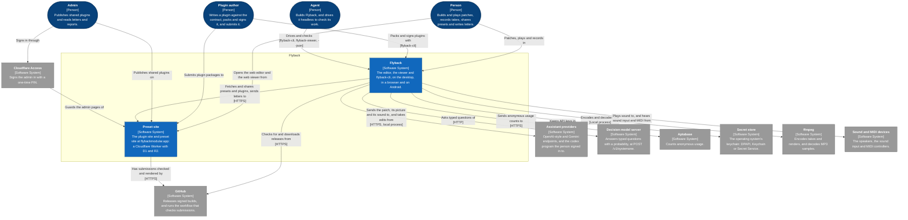

# C1: system context

Who uses Flyback and what it talks to. The C4 views are listed in the [README](README.md).

```mermaid
flowchart TB
    classDef person fill:#08427b,stroke:#052e56,color:#fff
    classDef system fill:#1168bd,stroke:#0b4884,color:#fff
    classDef external fill:#999999,stroke:#6b6b6b,color:#fff

    person(["<b>Person</b><br/>[Person]<br/>Builds and plays patches, records takes, shares presets and writes letters."]):::person
    pluginAuthor(["<b>Plugin author</b><br/>[Person]<br/>Writes a plugin against the contract, packs and signs it, and submits it."]):::person
    admin(["<b>Admin</b><br/>[Person]<br/>Publishes shared plugins and reads letters and reports."]):::person
    agent(["<b>Agent</b><br/>[Person]<br/>Builds Flyback, and drives it headless to check its work."]):::person
    subgraph flybackGroup["Flyback"]
        flyback["<b>Flyback</b><br/>[Software System]<br/>The editor, the viewer and flyback-cli, on the desktop, in a browser and on Android."]:::system
        presetSite["<b>Preset site</b><br/>[Software System]<br/>The plugin site and preset site at flybackmodular.app: a Cloudflare Worker with D1 and R2."]:::system
    end
    github["<b>GitHub</b><br/>[Software System]<br/>Releases signed builds, and runs the workflow that checks submissions."]:::external
    cloudflareAccess["<b>Cloudflare Access</b><br/>[Software System]<br/>Signs the admin in with a one-time PIN."]:::external
    providers["<b>Assistant providers</b><br/>[Software System]<br/>OpenAI-style and Gemini endpoints, and the codex program the person signed in to."]:::external
    decisionModel["<b>Decision model server</b><br/>[Software System]<br/>Answers typed questions with a probability, at POST /v1/systemone."]:::external
    aptabase["<b>Aptabase</b><br/>[Software System]<br/>Counts anonymous usage."]:::external
    secretStore["<b>Secret store</b><br/>[Software System]<br/>The operating system's keychain: DPAPI, Keychain or Secret Service."]:::external
    ffmpeg["<b>ffmpeg</b><br/>[Software System]<br/>Encodes takes and renders, and decodes MP3 samples."]:::external
    devices["<b>Sound and MIDI devices</b><br/>[Software System]<br/>The speakers, the sound input and MIDI controllers."]:::external

    person -- "Patches, plays and records in" --> flyback
    person -- "Opens the web editor and the web viewer from" --> presetSite
    pluginAuthor -- "Packs and signs plugins with<br/>[flyback-cli]" --> flyback
    pluginAuthor -- "Submits plugin packages to" --> presetSite
    admin -- "Publishes shared plugins on" --> presetSite
    admin -- "Signs in through" --> cloudflareAccess
    agent -- "Drives and checks<br/>[flyback-cli, flyback-viewer, --json]" --> flyback
    flyback -- "Fetches and shares presets and plugins, sends letters to<br/>[HTTPS]" --> presetSite
    flyback -- "Checks for and downloads releases from<br/>[HTTPS]" --> github
    flyback -- "Sends the patch, its picture and its sound to, and takes edits from<br/>[HTTPS, local process]" --> providers
    flyback -- "Asks typed questions of<br/>[HTTP]" --> decisionModel
    flyback -- "Sends anonymous usage counts to<br/>[HTTPS]" --> aptabase
    flyback -- "Keeps API keys in" --> secretStore
    flyback -- "Encodes and decodes with<br/>[Local process]" --> ffmpeg
    flyback -- "Plays sound to, and hears sound input and MIDI from" --> devices
    presetSite -- "Has submissions checked and rendered by<br/>[HTTPS]" --> github
    cloudflareAccess -- "Guards the admin pages of" --> presetSite
```
