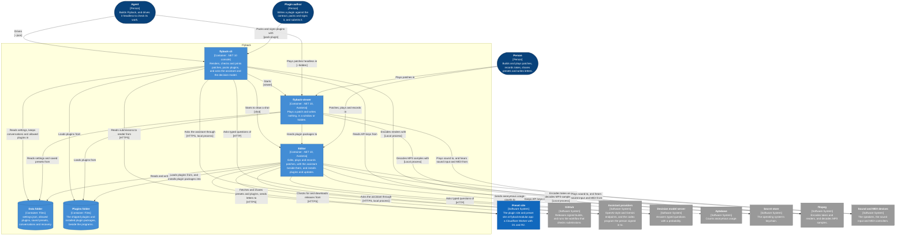

# C2: the desktop programs

Flyback's desktop programs, and where they keep what they keep. The C4 views are listed in the [README](README.md).

```mermaid
flowchart TB
    classDef person fill:#08427b,stroke:#052e56,color:#fff
    classDef system fill:#1168bd,stroke:#0b4884,color:#fff
    classDef container fill:#438dd5,stroke:#2e6295,color:#fff
    classDef store fill:#438dd5,stroke:#2e6295,color:#fff
    classDef external fill:#999999,stroke:#6b6b6b,color:#fff

    person(["<b>Person</b><br/>[Person]<br/>Builds and plays patches, records takes, shares presets and writes letters."]):::person
    pluginAuthor(["<b>Plugin author</b><br/>[Person]<br/>Writes a plugin against the contract, packs and signs it, and submits it."]):::person
    agent(["<b>Agent</b><br/>[Person]<br/>Builds Flyback, and drives it headless to check its work."]):::person
    subgraph flyback["Flyback"]
        editor["<b>Editor</b><br/>[Container: .NET 10, Avalonia]<br/>Edits, plays and records patches, with the assistant beside them, and installs plugins and updates."]:::container
        viewer["<b>flyback-viewer</b><br/>[Container: .NET 10, Avalonia]<br/>Plays a patch and writes nothing, in a window or hidden."]:::container
        cli["<b>flyback-cli</b><br/>[Container: .NET 10 console]<br/>Renders, checks and prints patches, packs plugins, and asks the assistant and the decision model."]:::container
        dataFolder[("<b>Data folder</b><br/>[Container: Files]<br/>settings.json, allowed plugins, saved presets, conversations and recovery.")]:::store
        pluginsFolder[("<b>Plugins folder</b><br/>[Container: Files]<br/>The shipped plugins and installed plugin packages, beside the programs.")]:::store
    end
    presetSite["<b>Preset site</b><br/>[Software System]<br/>The plugin site and preset site at flybackmodular.app: a Cloudflare Worker with D1 and R2."]:::system
    github["<b>GitHub</b><br/>[Software System]<br/>Releases signed builds, and runs the workflow that checks submissions."]:::external
    providers["<b>Assistant providers</b><br/>[Software System]<br/>OpenAI-style and Gemini endpoints, and the codex program the person signed in to."]:::external
    decisionModel["<b>Decision model server</b><br/>[Software System]<br/>Answers typed questions with a probability."]:::external
    aptabase["<b>Aptabase</b><br/>[Software System]<br/>Counts anonymous usage."]:::external
    secretStore["<b>Secret store</b><br/>[Software System]<br/>The operating system's keychain."]:::external
    ffmpeg["<b>ffmpeg</b><br/>[Software System]<br/>Encodes takes and renders, and decodes MP3 samples."]:::external
    devices["<b>Sound and MIDI devices</b><br/>[Software System]<br/>The speakers, the sound input and MIDI controllers."]:::external

    person -- "Patches, plays and records in" --> editor
    person -- "Plays patches in" --> viewer
    pluginAuthor -- "Packs and signs plugins with<br/>[pack-plugin]" --> cli
    agent -- "Drives<br/>[--json]" --> cli
    agent -- "Plays patches headless in<br/>[--hidden]" --> viewer
    editor -- "Fetches and shares presets and plugins, sends letters to<br/>[HTTPS]" --> presetSite
    editor -- "Checks for and downloads releases from<br/>[HTTPS]" --> github
    editor -- "Asks the assistant through<br/>[HTTPS, local process]" --> providers
    editor -- "Asks typed questions of<br/>[HTTP]" --> decisionModel
    editor -- "Sends anonymous usage counts to<br/>[HTTPS]" --> aptabase
    editor -- "Keeps API keys in" --> secretStore
    editor -- "Encodes takes and decodes MP3 samples with<br/>[Local process]" --> ffmpeg
    editor -- "Plays sound to, and hears sound input and MIDI from" --> devices
    editor -- "Reads and writes" --> dataFolder
    editor -- "Loads plugins from, and installs plugin packages into" --> pluginsFolder
    viewer -- "Plays sound to, and hears sound input and MIDI from" --> devices
    viewer -- "Decodes MP3 samples with<br/>[Local process]" --> ffmpeg
    viewer -- "Reads settings and saved presets from" --> dataFolder
    viewer -- "Loads plugins from" --> pluginsFolder
    viewer -- "Hands plugin packages to" --> editor
    cli -- "Reads submissions to render from<br/>[HTTPS]" --> presetSite
    cli -- "Asks the assistant through<br/>[HTTPS, local process]" --> providers
    cli -- "Asks typed questions of<br/>[HTTP]" --> decisionModel
    cli -- "Reads API keys from" --> secretStore
    cli -- "Encodes renders with<br/>[Local process]" --> ffmpeg
    cli -- "Reads settings, keeps conversations and allowed plugins in" --> dataFolder
    cli -- "Loads plugins from" --> pluginsFolder
    cli -- "Starts<br/>[viewer]" --> viewer
    cli -- "Starts to draw a shot<br/>[shot]" --> editor
```
