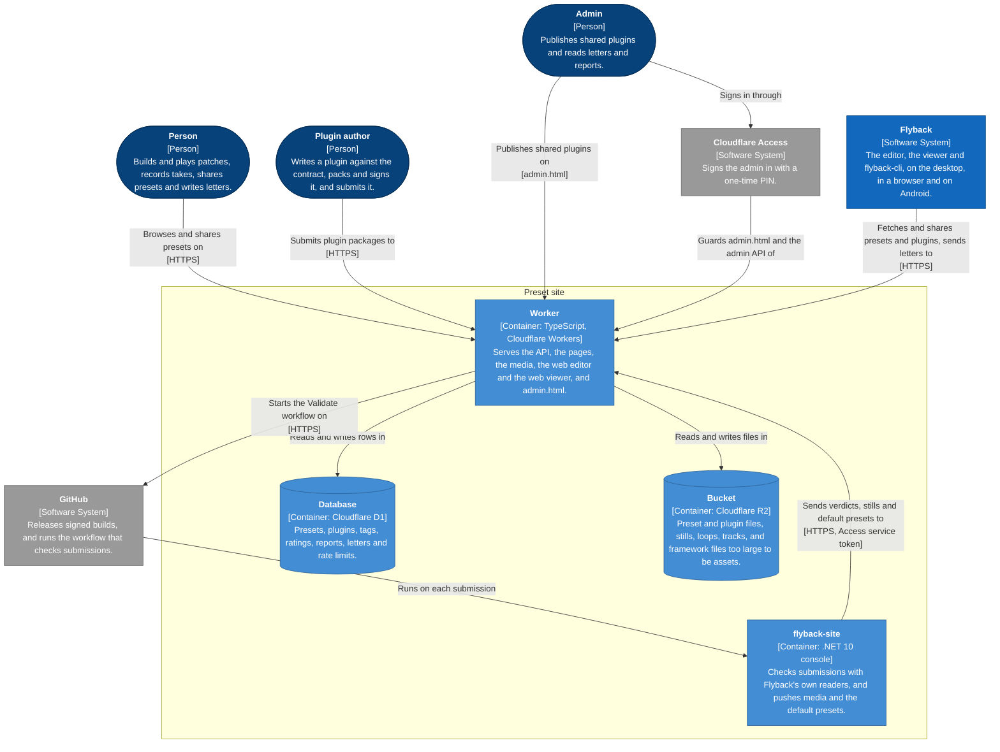

# C2: the preset site

What the preset site runs on, and how a submission is checked. The C4 views are listed in the [README](README.md).

```mermaid
flowchart TB
    classDef person fill:#08427b,stroke:#052e56,color:#fff
    classDef system fill:#1168bd,stroke:#0b4884,color:#fff
    classDef container fill:#438dd5,stroke:#2e6295,color:#fff
    classDef store fill:#438dd5,stroke:#2e6295,color:#fff
    classDef external fill:#999999,stroke:#6b6b6b,color:#fff

    person(["<b>Person</b><br/>[Person]<br/>Builds and plays patches, records takes, shares presets and writes letters."]):::person
    pluginAuthor(["<b>Plugin author</b><br/>[Person]<br/>Writes a plugin against the contract, packs and signs it, and submits it."]):::person
    admin(["<b>Admin</b><br/>[Person]<br/>Publishes shared plugins and reads letters and reports."]):::person
    flyback["<b>Flyback</b><br/>[Software System]<br/>The editor, the viewer and flyback-cli, on the desktop, in a browser and on Android."]:::system
    subgraph presetSite["Preset site"]
        worker["<b>Worker</b><br/>[Container: TypeScript, Cloudflare Workers]<br/>Serves the API, the pages, the media, the web editor and the web viewer, and admin.html."]:::container
        d1[("<b>Database</b><br/>[Container: Cloudflare D1]<br/>Presets, plugins, tags, ratings, reports, letters and rate limits.")]:::store
        r2[("<b>Bucket</b><br/>[Container: Cloudflare R2]<br/>Preset and plugin files, stills, loops, tracks, and framework files too large to be assets.")]:::store
        flybackSite["<b>flyback-site</b><br/>[Container: .NET 10 console]<br/>Checks submissions with Flyback's own readers, and pushes media and the default presets."]:::container
    end
    cloudflareAccess["<b>Cloudflare Access</b><br/>[Software System]<br/>Signs the admin in with a one-time PIN."]:::external
    github["<b>GitHub</b><br/>[Software System]<br/>Releases signed builds, and runs the workflow that checks submissions."]:::external

    person -- "Browses and shares presets on<br/>[HTTPS]" --> worker
    pluginAuthor -- "Submits plugin packages to<br/>[HTTPS]" --> worker
    admin -- "Publishes shared plugins on<br/>[admin.html]" --> worker
    admin -- "Signs in through" --> cloudflareAccess
    cloudflareAccess -- "Guards admin.html and the admin API of" --> worker
    flyback -- "Fetches and shares presets and plugins, sends letters to<br/>[HTTPS]" --> worker
    worker -- "Reads and writes rows in" --> d1
    worker -- "Reads and writes files in" --> r2
    worker -- "Starts the Validate workflow on<br/>[HTTPS]" --> github
    github -- "Runs on each submission" --> flybackSite
    flybackSite -- "Sends verdicts, stills and default presets to<br/>[HTTPS, Access service token]" --> worker
```
