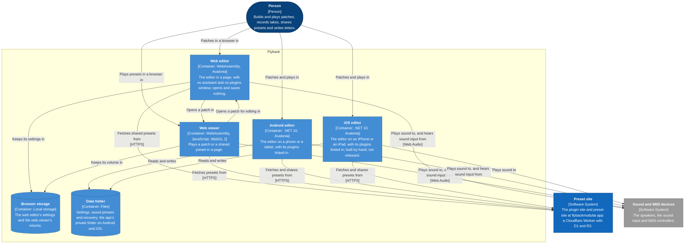

# C2: the browser, Android and iOS

Flyback in a browser, on Android and on iOS. The C4 views are listed in the [README](README.md).

```mermaid
flowchart TB
    classDef person fill:#08427b,stroke:#052e56,color:#fff
    classDef system fill:#1168bd,stroke:#0b4884,color:#fff
    classDef container fill:#438dd5,stroke:#2e6295,color:#fff
    classDef store fill:#438dd5,stroke:#2e6295,color:#fff
    classDef external fill:#999999,stroke:#6b6b6b,color:#fff

    person(["<b>Person</b><br/>[Person]<br/>Builds and plays patches, records takes, shares presets and writes letters."]):::person
    subgraph flyback["Flyback"]
        webEditor["<b>Web editor</b><br/>[Container: WebAssembly, Avalonia]<br/>The editor in a page, with no assistant and no plugins window; opens and saves nothing."]:::container
        webViewer["<b>Web viewer</b><br/>[Container: WebAssembly, JavaScript, WebGL 2]<br/>Plays a patch or a shared preset in a page."]:::container
        androidEditor["<b>Android editor</b><br/>[Container: .NET 10, Avalonia]<br/>The editor on a phone or a tablet, with its plugins linked in."]:::container
        iosEditor["<b>iOS editor</b><br/>[Container: .NET 10, Avalonia]<br/>The editor on an iPhone or an iPad, with its plugins linked in; built by hand, not released."]:::container
        browserStorage[("<b>Browser storage</b><br/>[Container: Local storage]<br/>The web editor's settings and the web viewer's volume.")]:::store
        dataFolder[("<b>Data folder</b><br/>[Container: Files]<br/>Settings, saved presets and recovery; the app's private folder on Android and iOS.")]:::store
    end
    presetSite["<b>Preset site</b><br/>[Software System]<br/>The plugin site and preset site at flybackmodular.app: a Cloudflare Worker with D1 and R2."]:::system
    devices["<b>Sound and MIDI devices</b><br/>[Software System]<br/>The speakers, the sound input and MIDI controllers."]:::external

    person -- "Patches in a browser in" --> webEditor
    person -- "Plays presets in a browser in" --> webViewer
    person -- "Patches and plays in" --> androidEditor
    person -- "Patches and plays in" --> iosEditor
    webEditor -- "Fetches shared presets from<br/>[HTTPS]" --> presetSite
    webEditor -- "Opens a patch in" --> webViewer
    webEditor -- "Plays sound to, and hears sound input from<br/>[Web Audio]" --> devices
    webEditor -- "Keeps its settings in" --> browserStorage
    webViewer -- "Fetches presets from<br/>[HTTPS]" --> presetSite
    webViewer -- "Opens a patch for editing in" --> webEditor
    webViewer -- "Plays sound to, and hears sound input from<br/>[Web Audio]" --> devices
    webViewer -- "Keeps its volume in" --> browserStorage
    androidEditor -- "Fetches and shares presets from<br/>[HTTPS]" --> presetSite
    androidEditor -- "Plays sound to, and hears sound input from" --> devices
    androidEditor -- "Reads and writes" --> dataFolder
    iosEditor -- "Fetches and shares presets from<br/>[HTTPS]" --> presetSite
    iosEditor -- "Plays sound to" --> devices
    iosEditor -- "Reads and writes" --> dataFolder
```
