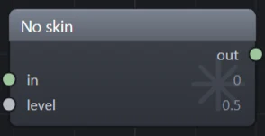
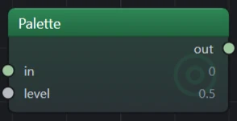
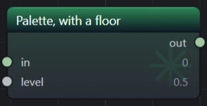
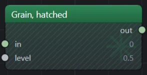
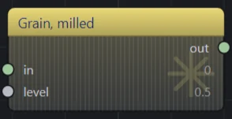
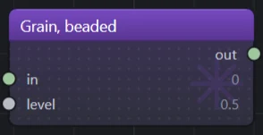
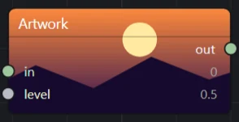
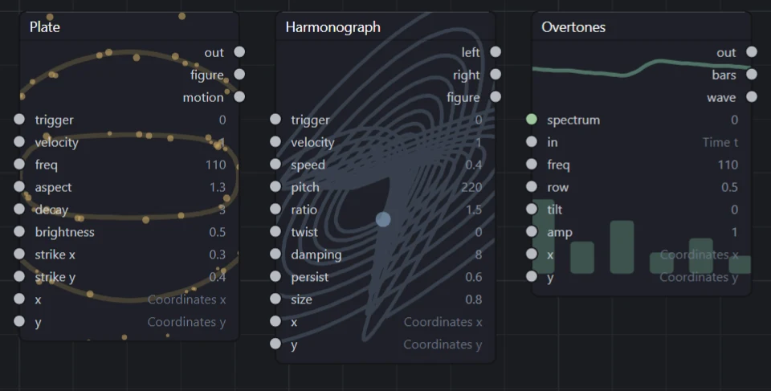

# Authoring Flyback plugins

Everything that differs per machine, and everything the engine deliberately does not know about, arrives from a folder on disk. This is how to put something in it: modules and presets in C#, and the sound and MIDI backends a platform needs.

1. [What a plugin is](#1-what-a-plugin-is)
2. [The project file](#2-the-project-file)
3. [The entry point](#3-the-entry-point)
4. [What you can contribute](#4-what-you-can-contribute)
5. [Authoring a module](#5-authoring-a-module)
6. [Modules that remember](#6-modules-that-remember)
7. [Shipping a patch](#7-shipping-a-patch)
8. [Sound and MIDI backends](#8-sound-and-midi-backends)
9. [Building and installing](#9-building-and-installing)
10. [How things fail](#10-how-things-fail)
11. [Testing](#11-testing)
12. [Rules of thumb](#12-rules-of-thumb)

## 1. What a plugin is

A plugin is one .NET assembly in its own folder under `plugins/`, beside the executable. Nothing references it at build time. The host enumerates the folders at startup, loads each into its own `AssemblyLoadContext`, and asks whatever it finds inside what it would like to contribute.

Two assemblies are host-owned: `Flyback.Plugins`, which is the contract, and `Flyback.Core`, which is what a patch and a module are made of: the graph, the sockets, the emitter a module lowers itself through, and the built-in modules a preset can name. A plugin compiles against both and ships neither. That rule is not a convention; it is what stops the same type having two identities and every cast across the boundary failing.

What runs a patch is a third assembly, `Flyback.Engine`: the compiler, the text language, the renderers and the file formats. A plugin never references it, so it can change from one release to the next without a plugin built against an older one noticing.

All three sit beside the executable rather than folded into it, so the two you need are there to compile against. Their `.xml` doc files sit beside them too, and your IDE reads them: what each `OpCode` computes, each `PortSpec` field, each `Emitter` call.

```text
Flyback(.exe)            ┐
Flyback.Core.dll         │ host-owned: always the host's copy,
Flyback.Plugins.dll      ┘ even if a stray duplicate sits in your folder
plugins/
  Voice/                 Flyback.Plugins.Voice.dll · .deps.json
  WinIO/                 Flyback.Plugins.WinIO.dll · NAudio.Wasapi.dll
  Flyback.Plugins.Yours/ yours, and whatever you depend on
```

Each folder is a load context of its own, so two plugins may use different versions of one package.

## 2. The project file

Four things matter, and each of them fixes a specific failure. This is the shape for a plugin built against an installed Flyback:

```xml
<Project Sdk="Microsoft.NET.Sdk">

  <PropertyGroup>
    <TargetFramework>net10.0</TargetFramework>
    <AssemblyName>Flyback.Plugins.Yours</AssemblyName>
    <RootNamespace>Flyback.Plugins.Yours</RootNamespace>
    <ImplicitUsings>enable</ImplicitUsings>
    <Nullable>enable</Nullable>
    <EnableDynamicLoading>true</EnableDynamicLoading>

    <!-- The folder Flyback is installed in: the one holding the executable. -->
    <Flyback>C:/Path/To/Flyback</Flyback>
  </PropertyGroup>

  <ItemGroup>
    <Reference Include="Flyback.Plugins" HintPath="$(Flyback)/Flyback.Plugins.dll" Private="false" />
    <Reference Include="Flyback.Core" HintPath="$(Flyback)/Flyback.Core.dll" Private="false" />
  </ItemGroup>

</Project>
```

- **`EnableDynamicLoading`** produces the `.deps.json` the resolver reads and the `runtimeconfig.json` `pack-plugin` checks for. Without it, nothing but the entry assembly resolves and your first dependency fails at load.
- **`Private="false"`** compiles against the host's assemblies without copying them next to yours. Your output is your assembly, its `.deps.json` and its `runtimeconfig.json`, and neither of the host's.
- **Name both references.** Naming only `Flyback.Plugins` leaves `Flyback.Core` to be copied in as a transitive reference, which is the same bug by a quieter route.
- **The assembly name is the folder name.** A package installs into `plugins/<AssemblyName>/`. `Flyback.Plugins.<Name>` is the convention; nothing enforces it.

`ImplicitUsings` is what the snippets below assume: they use `IReadOnlyList<>` and `MathF` bare.

Leave `Flyback.Engine.dll` alone, though it sits in the same folder. Nothing a plugin is handed comes from it, and a plugin that references it is bound to the one release it was copied from.

The release you compile against sets the oldest Flyback your plugin loads in, not the newest (see [Building and installing](#9-building-and-installing)). Build against the oldest one you mean to support.

Reference packages of your own freely. Your folder is your own load context, so your version of something does not have to agree with anyone else's.

### Inside this repository

`tests/Flyback.Plugins.Sample` is the worked example of a module plugin. A plugin under `src/plugins/` references the two projects instead:

```xml
<ItemGroup>
  <!-- Both are host-owned; shipping either gives its types a second identity. -->
  <ProjectReference Include="..\..\Flyback.Plugins\Flyback.Plugins.csproj"
                    Private="false"
                    ExcludeAssets="runtime"
                    GlobalPropertiesToRemove="OutDir" />
  <ProjectReference Include="..\..\Flyback.Core\Flyback.Core.csproj"
                    Private="false"
                    ExcludeAssets="runtime"
                    GlobalPropertiesToRemove="OutDir" />
</ItemGroup>
```

The repository's `Directory.Build.props` supplies the target framework and implicit usings.

## 3. The entry point

One public, non-abstract class with a parameterless constructor implementing `IFlybackPlugin`. The host finds it by reflection, constructs it, and calls `Register` once.

The types live in three namespaces:

| Namespace | What is in it |
|---|---|
| `Flyback.Plugins` | `IFlybackPlugin`, `IPluginRegistry`, `PluginInfo`, `FlybackModuleAttribute`; `Flyback.Plugins.Audio` and `Flyback.Plugins.Midi` hold the backend interfaces |
| `Flyback.Core.Graph` | `NodeDef`, `PortSpec`, `PortKind`, `EmitFn`, `EmitContext`, `ModuleProvider`, `ModuleSinks`, `ModuleSkin`, `Swatch`, `NodeExtra`, `ExtraField`, `ExtraState`, `NodeCatalog`, `ModuleCatalog`, `PatchBuilder`, `PatchPreset`, `PresetKind`, `PresetFiles`, `Patch` |
| `Flyback.Core.Compile` | `Emitter`, `Slot`, `OpCode` |

```csharp
using Flyback.Core.Graph;
using Flyback.Plugins;

// One per module Register adds. Assembly attributes go before the namespace.
[assembly: FlybackModule(Flyback.Plugins.Yours.RingsModule.TypeId, "Rings")]

namespace Flyback.Plugins.Yours;

public sealed class YoursPlugin : IFlybackPlugin
{
    private static readonly ModuleProvider Provider = new("yours", "Your modules");

    public PluginInfo Info { get; } = new(
        "yours",                       // stable, machine-readable
        "Your modules",                // what a person sees
        "One line about what this is.");

    public void Register(IPluginRegistry registry)
    {
        registry.AddModules(Provider, [RingsModule.Definition]);
        registry.AddPresets([YoursPresets.Pond]);
    }
}
```

> **The one hard rule about `Register`.** It runs on the UI thread during startup, for every installed plugin, before the window is usable. It must be cheap, and it must not open a device, read a credential, or reach the network. Deciding whether something can actually run belongs on the thing being registered; that is what `IsSupported` is for.

Declare every module `Register` adds with a `FlybackModule` on the assembly, giving the type id and name its `NodeDef` has. It is how the install dialog and the shared plugins site list your modules without running your code. Flyback checks it after `Register`: a plugin that registers a module it did not declare, or under another name, is refused whole. A module declared and not registered is fine, for one you leave out on some systems. `flyback-cli pack-plugin` loads your build and runs the same check before it writes a package, and it is the way to read the refusal from a command line (see [How things fail](#10-how-things-fail)).

Nothing stops an assembly holding more than one plugin class, and each is instantiated. Two plugins claiming the same `Info.Id` is refused: the first wins and the second becomes a note in the plugins window.

## 4. What you can contribute

`IPluginRegistry` has eight methods. New kinds of extension arrive as new methods, so a plugin compiled against an older contract keeps working.

| Method | Contributes | Must not, when registering |
|---|---|---|
| `AddModules` | Modules in the palette, keyed by a provider | — |
| `AddPresets` | Patches in the preset gallery | — |
| `AddAudioOutput` | A sound backend | Open a device |
| `AddSecretStore` | Somewhere the OS holds a secret, honored only from a plugin Flyback ships or one allowed with `--secrets` | Read or write one |
| `AddPatchAssistant` | Something that can author a patch, sending over the `IAssistantTransport` it is handed: the host puts the key on requests to the one origin it was entered for, and the assistant never holds it | Open a connection, or need a credential present |
| `AddMidiInput` | A MIDI backend | Open a device, or list the ones plugged in |
| `AddAudioInput` | A sound input backend, which a Line In listens through | Open a device, or list the ones plugged in |
| `AddDecisionModel` | Something that answers typed questions about some text with probabilities, sending over the transport it is handed as an assistant does | Load a model, open a connection, or need a credential or a file present |

A single plugin may call several. The Voice plugin adds eleven modules and four presets; a platform plugin such as WinIO adds a sound backend and a MIDI input and nothing else. Every kind is keyed by an id, and an id registered twice is refused to both, whichever plugins it comes from, so no folder can stand in for a plugin it shares an id with.

### Decision models

An `IDecisionModel` answers a `DecisionRequest`: a state, which is text, and up to 64 questions about it, each a `Question.Choice` of labeled options, a `Question.Score` on an ordered scale or a `Question.YesNo`. Each comes back as an `Answer` with its probabilities, so a feature can act only when the model is sure. `SystemOneWire` reads and writes the `POST /v1/systemone` format, and the shipped Decision server plugin is the whole of an HTTP one. A model that runs here and needs files also implements `IPreparedModel`: it names each file with its address, size and SHA-256, and the host asks before downloading them into the folder it passes as `DecisionConfig.Folder`, refusing any file that hashes otherwise. The plugin itself never downloads anything.

## 5. Authoring a module

A module is one `NodeDef`: its sockets, and a function that lowers it to ops. It is the same data the built-in modules are declared with; there is no second-class plugin module. Adding one changes nothing else in the pipeline: it appears in the palette and compiles on its own.

```csharp
using Flyback.Core.Compile;
using Flyback.Core.Graph;

namespace Flyback.Plugins.Yours;

public static class RingsModule
{
    public const string TypeId = "yours.rings";

    public static NodeDef Definition { get; } = new(
        TypeId, "Rings", "Patterns",
        [
            new PortSpec("x", NormalledTo: NodeCatalog.Across) { Standard = true },
            new PortSpec("y", NormalledTo: NodeCatalog.Down) { Standard = true },
            new PortSpec("freq", PortKind.Scalar, 4f, 0f, 32f) { Help = "Rings from the middle to the edge." },
        ],
        [new PortSpec("out", PortKind.Scalar, 0f, -1f, 1f) { Help = "The rings, -1 to 1." }],
        Emit,
        "Concentric sine rings.");

    private static Slot[] Emit(Emitter em, EmitContext i)
    {
        var radius = em.Binary(OpCode.Hypot, i[0], i[1]);
        return [em.Unary(OpCode.Sin, em.Mul(em.Mul(radius, i[2]), MathF.Tau))];
    }
}
```

The emit function is an `EmitFn`: `Slot[] (Emitter em, EmitContext node)`. `node[port]` is the slot an input arrives on, and the array it returns is one slot per output, in order.

### Categories

The third argument is the palette heading. Join one the engine has: `Color`, `Feedback`, `Filters`, `Forms`, `Geometry`, `Maths`, `Measurement`, `Oscillators`, `Patterns`, `Pitch`, `Routing`, `Shaping`, `Sources`, `Time effects` or `Timing`. `flyback-cli modules` lists them as the running build has them. A name the engine does not know makes a heading of its own, drawn gray (ADR-0116).

### The type id prefix rule

Every type id must begin with your provider's id and a dot. That single rule does three jobs: it makes shadowing a built-in impossible, it makes a collision between two plugins impossible, and it means the provider of a module can be read off a saved patch file without having the plugin that defines it. Ids that break it are dropped individually: one bad module costs that module, not the plugin.

### Sockets

`PortSpec(Name, Kind, Default, Min, Max, ...)` carries more than a name. Most of it is the editor's business rather than the compiler's: a stored number means the same thing whatever these say.

| Field | What it does |
|---|---|
| `Help` | Set with `{ Help = … }`: what this one socket is for, in a sentence or two that stand on their own. The inspector shows it as the tip on the socket's row, outputs included, and the assistant reads it when it looks the module up. What the module is for, and how its sockets work together, goes in the `NodeDef`'s description, which heads the inspector. Give every socket one; nothing checks that you did. |
| `Standard` | Set with `{ Standard = true }` in place of `Help` where the socket means what its name means everywhere. Its help is then the standard for its name, the same words as on every other module, listed in [Standard help](#standard-help) below. Read them before opting in: standard `freq` is wrong for a rings count or a filter's corner, and standard `t` is a blend's position, not a clock. A socket that asks for a name with no standard is a mistake in the plugin: the module is refused, and the refusal names the socket. |
| `Kind` | `Scalar`, `Color`, or `Any`. `Any` passes through whatever arrives, which is how one Expression works on both a tone and a picture. |
| `Default`, `Min`, `Max` | The knob on the node, and the range the editor gives it. A `Color` input has no knob at all: a single number cannot hold a color, so it takes a wire only. On an output, `Min` and `Max` say what it puts out (`-1f, 1f` for a wave, `0f, 1f` for an envelope), and an Auto remap wired to it reads them. Left at the default −4 to 4, a socket has no range, and an Auto remap asks for plain numbers there. A `Color` socket is always 0 to 1. |
| `Lenient` | Set with `{ Lenient = true }` on an input where a value past either end of the range still means something: a phase or a hue wraps round, a gate or a trigger reads a threshold. A wire swinging past any other input's range is drawn in orange and warned about. |
| `Knee` | How far above `Min` the knob stops sweeping evenly and starts sweeping in decades; 0 sweeps evenly throughout. It is a distance from the bottom, not a value: the engine's own `freq`, 0 to 20 000 Hz, has a knee of `0.02f`, so every octave above a fiftieth of a hertz gets the same turn of the knob and of an Auto remap. A cutoff from 20 Hz up wants a knee of a few hertz. |
| `NormalledFrom` | Index of an earlier input this one falls back to when nothing is patched in: the hardware normalled jack. The Output's `right` carries `left` this way. |
| `NormalledTo` | A module driving this input while nothing is patched into it, named as `new PortNormal(typeId, port)`. The module is hidden (no node, no wire), and one instance is shared by every socket normalled to it. The socket then has no knob: the value stored against it is never read, so the editor names the module where the number would be. Name a module the engine ships (`NodeCatalog.Clock` is Time, `Across` and `Down` are Coordinates) or one of your own; a type id the running catalog lacks drops the socket back to its knob. |
| `Display` | `Number`, `Note` (57 reads as A3), `Duration` (a power of ten of seconds, shown as the time it is), `Integer` (a whole-number setting), or `Chord` (a Chord's pick, 4 reads as maj). `Note`, `Integer` and `Chord` step rather than slide. |
| `Domain` | True when this is the axis the module is read across rather than a value it uses. A constant on one is never sensible, which is why every domain in the catalog is `NormalledTo` Time; the compiler still warns about one that is normalled to nothing. |
| `Swept` | True when the module supplies the domain this input is read under. Resolve it yourself with `EmitContext.Resolve`. |
| `PatchOnly` | True when `Default` is a filler nobody should dial, kept only so the compiler has something to read while nothing is wired in. The editor draws no knob for it and says what the socket does instead. The Output's `left` is one. |

### Standard help

What `{ Standard = true }` fills in, by socket name. Any input marked `Domain` gets the domain line whatever it is called, and needs no `Standard`. There is no standard `cutoff`.

| Input | Help |
|---|---|
| `x`, `y` | Where on the picture it is read: the pixel's own without a wire. A Geometry module in between moves, turns or bends it. |
| `freq` | Cycles for each unit of 'in': hertz while it runs on Time. |
| `phase` | Where in the cycle it starts. 1 is once round, so it wraps. |
| `amp` | Multiplies what comes out, which swings -1 to 1 before it. |
| `bias` | Added after 'amp', moving the whole output up or down. |
| `right` | Carries 'left' when nothing is patched. |
| `mix` | Dry against wet: 0 is a wire, 1 the effect alone. |
| `resonance` | Peaks the corner, until it rings on a sharp edge. |
| `attack` | How long the rise to full takes. |
| `depth` | How far the sweep swings. |
| `seed` | Which random run it takes. Give each module its own; two with the same seed move together. |
| `angle` | In radians. |
| `t` | How far along: 0 is all 'a', 1 is all 'b'. |
| `gate length` | How much of each step the gate stays open. |
| any `Domain` | What it runs across: Time without a wire, so it moves. A coordinate lays it across the screen instead. |

| Output | Help |
|---|---|
| `x`, `y` | The moved coordinate. Patch it into the 'x' and 'y' of the pattern to be moved. |
| `lfo` | The sweep itself, -1 to 1. It works on the picture too. |
| `radius` | Distance from the center. |
| `distance` | Negative inside, zero on the edge, positive outside. |

`flyback-cli modules <type id>` prints the help each socket ended up with, which is the quickest check.

### What a module means to the speakers

The speakers have no pixel. On the sound side Coordinates reads 0 for `x` and `y`, so a module that is a function of position alone, like Rings above, is silent there however it is wired. A module is heard in one of two ways:

- it runs across a domain normalled to Time (`NodeCatalog.Clock`), as every oscillator does, and a coordinate patched into that domain lays it across the screen instead;
- or a patch hears its picture through a Scan, which sweeps a loop round the image at an audible rate. A Scan centered on rings hears a constant; move its `x` off the center and it hears the rings.

Say which in the description.

An oscillator takes its phase from `em.Phase(domain, frequency, offset)` rather than multiplying the domain by the frequency. It accumulates, so turning the frequency glides the pitch instead of jumping the wave, and a long run stays exact. It answers 0 to 1, once round per cycle:

```csharp
new PortSpec("t", NormalledTo: NodeCatalog.Clock) { Domain = true },
new PortSpec("freq", PortKind.Scalar, 220f, 0f, 20000f) { Standard = true, Knee = 0.02f },

private static Slot[] Emit(Emitter em, EmitContext i) =>
    [em.Unary(OpCode.Sin, em.Mul(em.Phase(i[0], i[1], em.Constant(0f)), MathF.Tau))];
```

On the picture, where there is no previous sample to accumulate from, `Phase` is the plain multiply.

### Which sink a module is for

Every module is compiled for both sinks, because a patch is one graph. `Sinks`, an init property on the `NodeDef`, says where it means what it says: `ModuleSinks.Both` (the default), `Audio` for a module that wants a memory and gives the screen something simpler, or `Video` for one that wants a pixel or a past frame. It changes nothing that is emitted; the assistant's handbook and `flyback-cli modules` read it, so set it whenever it is not `Both`.

### What a module is known by

`Words`, an init property on the `NodeDef`, is what else a person might call the module, a few words apart by commas: `"glide, portamento, smoothing"` on a Slew, `"room, hall, space"` on a Reverb. The module list and `flyback-cli modules --find` match a typed word against the name and these words, so a plugin's module is found by what it does and not only by what it is called, and the decision model reads them beside the name when it ranks modules by meaning. Keep them short: a sentence here pulls the model's answer toward whichever module it read first.

### How a module is drawn

By default a module is drawn as its category, and a category the engine does not know draws gray (ADR-0116). `Skin`, an init property on the `NodeDef`, gives a module a background of its own instead. Only the background changes. The block keeps its shape, its header, where its title sits, its sockets and its description: a canvas of modules that each laid themselves out differently would stop being a patch.

There are three backgrounds. Colors are a `Swatch(red, green, blue)`, because Core names no toolkit. Picture, Voice, Effects and Mastering all stay in the family this way (Circle, Bell and the Compressor among them): a `Palette` whose `Accent` is its own category's, with a `Glyph` of its own rather than the category's.

| | |
|---|---|
|  | **No skin.** Drawn as its category, which is where every module starts. |
|  | **Palette.** One color, standing exactly where the category's accent would, with a mark of the plugin's own behind the labels. |
|  | **Palette, with a floor.** The wash falls to a second color instead of back to the first. |
|  | **Grain, hatched.** Diagonal rules over the body, the coarsest of the three cuts. |
|  | **Grain, milled.** Fine upright rules, on a pale accent with `ContrastText`: the title went dark and the socket labels stayed light, because they sit on different surfaces. |
|  | **Grain, beaded.** A grid of dots, the quietest cut. |
|  | **Artwork.** An SVG, scaled to cover the body and clipped to it. It runs behind the header band, which keeps only its relief. |

Those are drawn by the canvas itself rather than mocked up, from the same code the app paints a patch with; `SkinShotTests` retakes them.



*Artwork, as shipped.* Figures, the plugin the preset site starts with, gives each of its three modules a picture of what it is: an SVG for the block and a taller one for the panel, drawn a shade under the node gray so the white labels still read.

```csharp
// A palette: drawn exactly the way every built-in module is.
Skin = new ModuleSkin.Palette(new Swatch(0x2E, 0x8B, 0x57))
{
    Floor = new Swatch(0x10, 0x20, 0x30),
    Glyph = "M4,12 A8,8 0 1,1 20,12 A8,8 0 1,1 4,12",
},

// A grain: the same palette with a texture cut across it.
Skin = new ModuleSkin.Grain(new Swatch(0x4A, 0x7E, 0xC8), GrainCut.Beaded),

// A picture: SVG, PNG or GIF, scaled to cover the body and clipped to it.
Skin = new ModuleSkin.Artwork(bytes) { ContrastText = true },

// Two pictures: the block's, and one of the panel's own shape.
Skin = new ModuleSkin.Artwork(block) { Panel = tall },
```

| Field | What it does |
|---|---|
| `Palette.Accent` | The one color everything is worked out from, standing exactly where the category's accent would: the wash down the body, the band across the header, and the mark behind the labels. |
| `Palette.Floor` | What the wash falls to at the floor. Left out, it falls to the accent, the way a built-in module does. |
| `Palette.Glyph` | The mark across the body, as SVG path data on the same 24-unit box the engine's own marks are drawn on. Stroked, not filled. Path data that will not parse draws nothing rather than taking the canvas down. Left out, the category's mark stands. |
| `Grain.Cut` | `Hatched` (diagonal rules), `Milled` (fine upright rules) or `Beaded` (a grid of dots), tiled over the body in graph units so the texture holds its pitch at any zoom. A grain is a palette and carries all of its fields; the cut is a second channel, and the one that still says whose the module is in a grayscale screenshot or to somebody who cannot separate two hues. |
| `Artwork.Bytes` | The picture itself, most often read out of the plugin's own embedded resources. Bytes rather than a path, so a skin needs nothing deployed beside the assembly. Bytes that are not a picture are no picture: the module falls back to its category. An animated GIF runs, and the canvas repaints only while a module that is animating is actually on it. |
| `Artwork.Panel` | A second picture for the panel on the right, where `Bytes` is the block's. A block is a wide strip a few sockets tall and the panel is most of a column, and cover crops whatever does not fit. Left out, the one picture is drawn on both. |
| `ContrastText` | On any of the three. Whether the text on the module is worked out from the background behind it rather than drawn white; see below. |

The person using Flyback has the last word. Two switches under **Settings → Canvas** answer two different complaints. *Let a plugin paint its own modules*, cleared, draws every module as its category and ignores every skin. *Play animated module backgrounds*, cleared, holds every animation at its first frame. Write a skin that is worth having and neither gets cleared; write one that fights the canvas and it will be.

#### Text that can be read on any background

Every module on the canvas is titled in white, and a module that picks a dark color should not be the one whose title is a different color from every other. So white stays the default and `ContrastText` is opt-in. It is for the case the shell cannot rescue on its own: a pale, saturated or busy background, where white is simply gone.

Where it is asked for, every line of text on the module (the title, the socket names, the numbers, the normalled module names) is derived from the background that line covers, by one rule with no table in it. The ink is the inverse of what is behind it, driven toward whichever pole the background is not until the two are half the luminance range apart. Inverting alone fails in the middle: a mid-gray inverts to itself. The drive is solved for rather than stepped, so text over a gradient stays continuous, and the direction is decided once for a whole surface, so a word is never dark at one end and light at the other. Over a picture the same rule reads the artwork's own horizontal bands in place of the gradient's stops.

### Carrying something that is not a knob

A socket carries a number a patch can drive. Some decisions are not that: they are decisions about the piece rather than signals in it, and no arrangement of sockets expresses one. The engine carries its own that way: a sequencer's notes, a Quantiser's scale, an Arrangement's parts, a Sample's file. Your module can carry its own by declaring a `NodeExtra`.

You declare a key and the values it holds. Everything else (seeding a fresh instance, storing it in the patch file, folding it onto the context your emit function reads, describing it to the assistant, and naming it as an argument in the text language) has a default written in terms of that declaration, so there is nothing else to override.

```csharp
public sealed record GlideExtra : NodeExtra
{
    public override string Key => "glide";

    public override IReadOnlyList<ExtraField> Fields =>
    [
        new ExtraField.Number("time", "time", new PortSpec("time", PortKind.Scalar, 0.1f, 0f, 1f))
        {
            Help = "How long a note takes to slide to the next, in seconds.",
        },
        new ExtraField.Toggle("legato", "legato") { Help = "Slides only between notes that overlap." },
    ];
}

// on the NodeDef
Extras = [new GlideExtra()],

// in the emit function
var state = node.Extra<ExtraState>("glide");
var time = state?.Number("time") ?? 0.1f;
```

You do not ship a control. The shell draws the rows from what you declared, which is why a plugin never references Avalonia and is never pinned to the version of it a given build shipped. An `ExtraField.Number` takes a whole `PortSpec`, so your row gets the same slider, snapping and formatting a socket's knob has: declare `Display` as `Note` and 57 reads as A3, exactly as it would on a knob. Give every field a `Help`, as you would a socket: the inspector shows it as the tip on the field's row, and `describe_module` and `flyback-cli modules` print it beside the field's key.

The same declaration is what lets an assistant set your state, through one `set_extra` tool that works for any plugin's kind, and what lets a patch written as text set each field as a named argument: a `Choice` keyed `profile` is `yours.rings(freq: 4, profile: "triangle")`. There is nothing to write for either.

Four shapes exist. `Number` and `Toggle` are a value and a switch; `Choice` picks one of a list of `ChoiceOption(id, name)`, read afresh each time the row is drawn, so the list can be computed (MIDI In uses one to choose its instrument), and is read back with `state.Chosen(key)`. A stored id that is not in the list is kept rather than reset, since it is usually a device that is unplugged right now. `Text` is a line somebody types, read back with `state.Text(key)`; an Expression's formula is one. The vocabulary grows only when a plugin is genuinely blocked on another shape. What it deliberately cannot express is a control of your own: no keyboard, no waveform display, no list you reorder. If yours is that shape, say so; the trade is recorded in ADR-0055 and is meant to be revisited by a real case, not guessed at.

A file is the other thing a module carries. Derive from `FileExtra` instead and give it a `FileKind`, which says what the panel's row is called, what the picker offers and what a report says; the row, the path in the text language (`path("star.svg")`), carrying the file in a bundle, moving it with the patch and the assistant's `set_sample` all come with it. Your `Fold` reads the file through `env.Samples`: `FindFile(path)` hands the bytes of a format you parse yourself and `FindPicture(path)` a PNG already decoded, on either program, with `ExplainFile(path)` saying why one came back null. The host reads, caps and keeps the file, answering with the same array until it is forgotten, so cache your parse against that array and an edit costs nothing. Drawings' Path is one: it parses SVG and OBJ from the bytes and traces a PNG's outlines.

Your values live under your key in the patch file and are round-tripped whether or not the plugin is loaded, so a patch opened without you keeps what it carried. What arrives is only ever what somebody could have typed into the file, so every read is held to the range you declared: a number outside it is clamped rather than refused, and nonsense reads as your default.

### The emit function

It runs once, at compile time, and writes straight-line ops into a flat register machine. This is the fact that shapes everything else about writing one:

- It never sees a knob's value, so nothing about the shape of what you emit can depend on one. The Supersaw has seven voices rather than a knob's worth for exactly this reason.
- There are no branches. A choice is arithmetic (`Step`, `Mix`, `Clamp`), not an `if`.
- It runs whole or not at all. Reaching for one output compiles everything upstream of all your inputs, because the compiler cannot know which output uses which.
- Loops that unroll are fine and normal. Seventy ops with no branches is what the Supersaw is.

The `Emitter` gives you the instruction set: `Unary`, `Binary` and `Ternary` over `OpCode`, plus `Constant`, `Load` for the pixel's x, y and t, and the shorthands `Add`, `Sub` and `Mul`. `Add` and `Mul` also take a `float`; `Sub` takes two slots, so subtract a number with `em.Add(a, -n)` or `em.Sub(em.Constant(n), a)`. Widths broadcast the way a shading language would: a scalar meeting a color is applied to all three channels.

What each opcode computes, and in what operand order, is on its doc comment in `Flyback.Core.xml`. The ones you reach for first:

| Op | Computes |
|---|---|
| `Sin`, `Cos` | Of radians, so a cycle is `MathF.Tau` |
| `Mix` | `a + (b - a) * c`: `c` of 0 is `a`, 1 is `b` |
| `Clamp` | `a` held between `b` and `c` |
| `Step` | `a` is the edge: 0 where `b` is below it, 1 from it |
| `Hypot` | `√(a² + b²)` |
| `Fract` | What is left above the floor |
| `Exp` | `eᵃ`, and 0 where the result is not finite |

## 6. Modules that remember

The engine renders a picture by evaluating the program once per pixel, with rows in parallel and in no particular order. That is why most modules are pure functions of (x, y, t), and why a module with a memory is a different kind of thing, which works for the speakers and has to say what it means for the screen.

There are four tiers, and it is worth knowing which one you need before you start.

| Tier | Uses | What it is |
|---|---|---|
| **Pure** | Most modules | No memory at all. Identical at both sinks, free on the video path, survives to the GPU backend untouched. Reach for this unless you cannot. |
| **One evaluation** | Emitter cells | A cell that carries a value from the last evaluation to this one. Filters, allpass stages, slew limiters, sample-and-hold. Available to any plugin, no engine change. |
| **A plane** | Emitter planes | A cell the screen keeps too: one value per pixel, carried from the previous frame. What a loop drawn on the canvas uses. Available to any plugin; ask for one only when a picture should accumulate. |
| **A buffer** | Delay · Allpass | Thousands of past samples: a delay line or a reverb tail. Needs an opcode, so it cannot come from a plugin; use the two that exist. |

### Taking a cell

`AllocateUnitSlot` hands you a cell; `UnitRead` gets what it held last evaluation and `UnitWrite` puts this evaluation's value in it. Read before you write, and the gap between the two is the one evaluation of latency that makes it a memory.

```csharp
var cell = em.AllocateUnitSlot();
var previous = em.UnitRead(cell);        // what it held last time
var smoothed = em.Ternary(OpCode.Mix, previous, input, amount);
em.UnitWrite(cell, smoothed);           // what it holds next time
```

A value written to a cell is clamped to the rails on its way in, which keeps a bad value from persisting. A cell holding a time rather than a signal (where a trigger arrived, say) is written with `ClockWrite` instead, which is not clamped.

A cell is one scalar wide, so a module with a memory takes `Scalar` sockets where a pure one would take `Any`.

### Taking a plane

`AllocatePlaneSlot`, `PlaneRead` and `PlaneWrite` are the same three calls, but on the video path the value is kept for each pixel from one frame to the next: a trail that decays, a per-pixel envelope, a reaction-diffusion step. On the audio path a plane behaves like a cell. Do not reach for one to make a filter work on a picture: a filter over frames is a different effect, and every plane costs a value per pixel.

### Lowering part of a module once

A module read through a `Swept` input is lowered once per place it is read at. Whatever of it does not depend on the place can go behind `em.Once(key, inputs, lower)`, which lowers it the first time and hands the same slots back wherever `inputs` and the x, y and t it read are the same. Name every slot `lower` reads that it did not make; x, y and t are noticed on their own. State claimed inside is claimed once, so a strike kept in planes is one strike however many places the module is read at.

```csharp
Slot[] ring = em.Once("ring", [trigger, velocity], () => Ring(em, trigger, velocity));
```

### The two questions every stateful module has

Both are answered by the emitter, once per program rather than once per module, so four filters in one patch cost two cells between them and not eight.

- **`em.Interval()`**: how far the clock moved since the previous evaluation, in seconds. Nothing tells a module its sample rate; this is the sample rate, said the other way round. It is what turns a cutoff in hertz into a coefficient.
- **`em.HasMemory()`**: one where the program has state behind it, zero where it has none.

The second matters more than it looks. An emit function runs at compile time, long before anything knows which sink is about to run the program, so this flag is the only way to ask. Mixing on it gives the video path an answer you chose.

A whole one-pole lowpass, with a mix that is a wire at zero and a picture that is a wire always:

```csharp
public static NodeDef Definition { get; } = new(
    "yours.smooth", "Smooth", "Filters",
    [
        new PortSpec("in", PortKind.Scalar, 0f, -1f, 1f) { Help = "The signal to smooth." },
        new PortSpec("cutoff", PortKind.Scalar, 1000f, 20f, 20_000f)
        {
            Help = "Where the highs start to fall away, in hertz.",
            Knee = 5f,
        },
        new PortSpec("mix", PortKind.Scalar, 1f, 0f, 1f) { Standard = true },
    ],
    [new PortSpec("out", PortKind.Scalar, 0f, -1f, 1f) { Help = "The smoothed signal." }],
    Emit,
    "A one-pole lowpass: fast wiggles above the cutoff are rounded off. "
    + "Sound only: on the picture, which has no past to smooth against, it passes 'in' through.")
{
    Sinks = ModuleSinks.Audio,
};

private static Slot[] Emit(Emitter em, EmitContext i)
{
    var dry = i[0];

    // The coefficient is 1 - e^(-2π · cutoff · interval).
    var exponent = em.Mul(em.Mul(i[1], em.Interval()), -MathF.Tau);
    var amount = em.Sub(em.Constant(1f), em.Unary(OpCode.Exp, exponent));

    var cell = em.AllocateUnitSlot();
    var smoothed = em.Ternary(OpCode.Mix, em.UnitRead(cell), dry, amount);
    em.UnitWrite(cell, smoothed);

    // A picture is one evaluation with nothing before it, so HasMemory is 0 there.
    var wet = em.Mul(i[2], em.HasMemory());
    return [em.Ternary(OpCode.Mix, dry, smoothed, wet)];
}
```

A module with several outputs decides each one. A filter bank on the screen sees a signal that never moves, and its response to that is everything through the lowpass and nothing through the other two:

```csharp
var live = em.HasMemory();

return
[
    em.Ternary(OpCode.Mix, dry, lowpass, live),   // a wire, with no state
    em.Mul(bandpass, live),                       // silent
    em.Mul(highpass, live),                       // silent
];
```

> **What the video path does on its own.** With no state passed, `UnitRead` gives zero and `UnitWrite` goes nowhere (only a plane is kept), a Delay hands its input straight through, and Phase becomes the multiply it replaced. Those fallbacks are total and will not crash, but whether they mean anything is yours to decide. A delay line becomes a wire for free; a bank of allpass stages becomes whatever the arithmetic happens to leave, which is why it should say so explicitly instead.

> **A module for the eye has one more gate.** The preview draws on the GPU, and a table read (`em.Table`, which is a clip or a trace) is a float texture there, read as the interpreter reads it. Cells and delay lines lower to the same no-state fallback the interpreter uses on the video path, so the two backends still agree. Planes are kept by the shader as well, as channels of a float render target; a graphics context that cannot provide one draws the frame on the CPU instead. If your module is for the picture, keep it to arithmetic.

### Buffers

For a real delay, `em.DelayLine(OpCode.Delay, input, feedback, time, maximum)`. The time is a signal and may be swept (reads interpolate, so it glides rather than steps), but the maximum is fixed at compile time, because it sizes a buffer and a buffer cannot be resized from the audio thread. `OpCode.Allpass` is the same shape and smears without coloring.

Note the cost: two seconds at the oversampled audio rate is about 1.5 MB per line. Ask for what you need.

## 7. Shipping a patch

A preset is how a plugin shows its modules wired up properly. It is a name and a function, and the function is handed the catalog when the preset is picked, not when it is registered, so it can freely use the modules the same plugin just added.

`new PatchPreset(name, build, description, kind)`:

- The **description** is a line saying what the preset is for. The patch it builds carries it as its own description, unless the patch sets one itself with `patch.Describe(...)`, and that is what the gallery shows under the name.
- The **`PresetKind`** says which heading of the preset gallery it belongs under: `Idea` for one idea at one sink, which is the default; `Interplay` where sound and picture are the same thought; `Showcase` for a whole piece. Say which, or yours is filed as an idea whatever it is.
- **`Tags`**, an init property, are the words the gallery filters by, as a patch's own tags are.

```csharp
using Flyback.Core.Graph;

namespace Flyback.Plugins.Yours;

public static class YoursPresets
{
    public static PatchPreset Pond { get; } = new(
        "Pond", Build, "Rings on the screen, heard through a Scan and smoothed.", PresetKind.Interplay)
    {
        Tags = ["rings", "scan"],
    };

    private static Patch Build(ModuleCatalog modules)
    {
        var b = new PatchBuilder(modules);

        var rings = b.Add(RingsModule.TypeId, (2, 6f));                       // (port, knob)
        var scan = b.Add(NodeCatalog.ScanTypeId, (2, 110f), (3, 0.35f), (4, 0.2f));
        var smooth = b.Add("yours.smooth", (1, 3000f));
        var output = b.Add(NodeCatalog.OutputTypeId, (3, 0.25f));

        b.Wire(rings, 0, output, NodeCatalog.OutputColorPort)
         .Wire(rings, 0, scan, 0)
         .Wire(scan, 0, smooth, 0)
         .Wire(smooth, 0, output, NodeCatalog.OutputLeftPort);

        return b.Build();
    }
}
```

The Output's sockets are `OutputColorPort` (0, the screen), `OutputLeftPort` (1), `OutputRightPort` (2, carrying left when nothing is patched) and `OutputVolumePort` (3). `flyback-cli modules <type id>` prints any module's sockets by number, which is what the port arguments of `Add` and `Wire` count.

`b.Add` hands back the `NodeInstance`, which is where a preset sets an extra. Stored state is a JSON object under the extra's key, one property per field:

```csharp
using System.Text.Json.Nodes;

var glide = b.Add("yours.glider");
glide.SetState("glide", new JsonObject { ["time"] = 0.3f, ["legato"] = true });
```

A field left out reads as its default. The engine's own extras have helpers, such as `SampleExtra.Set` below.

Flyback turns every one- and two-input Maths module in your preset into an Expression as it is built, folding chains of them into one formula, and lays the patch out again. The result sounds and looks exactly as you wired it, so wire the arithmetic whichever way reads best in your code.

A preset that plays a sound file or shows a picture carries it inside your plugin. Embed each file under a folder of its own, name it in the patch by its name in that folder, and hand the preset the folder with `PresetFiles.Embedded`. The files open with the preset as a bundle's do, so it plays on a machine that has never had them, and saving it keeps them beside it.

```xml
<!-- in the .csproj -->
<EmbeddedResource Include="Speaking\*.wav" LogicalName="Speaking/%(Filename)%(Extension)" />
```

```csharp
new PatchPreset("Speaking", Build)
{
    Files = PresetFiles.Embedded(typeof(YoursPlugin).Assembly, "Speaking"),
};

// and in Build, a Sample named by the file's name in the folder
SampleExtra.Set(b.Add(NodeCatalog.SampleTypeId), "hello.wav");
```

Nothing in a preset says where a module sits, and nothing should: a preset states what the patch is and what is wired to what, and `b.Build()` puts the coordinates on with the same layout the Tidy button and the text language use, so the patch reaches the canvas already reading left to right. Taking `b.Patch` instead hands over a pile at the origin; the trade is recorded in ADR-0070.

Presets are listed under their heading by name, a plugin's among the engine's own, in the same order on the desktop and on the web. Because a patch is keyed by type id, one that uses your modules records what it needs, and opening it somewhere your plugin is absent refuses cleanly rather than loading a broken graph.

A preset that reaches for another plugin's modules is allowed and worth a moment's care: it is built when it is picked, so a missing plugin surfaces there. Check first with `modules.HasProvider(id)` and throw something that names the plugin, or the reader gets a module id they never asked about.

## 8. Sound and MIDI backends

The application has no platform-specific code in it at all; every sound device is a plugin. A backend is two classes: one that offers itself, one that opens the device.

```csharp
public sealed class JackOutput : IAudioOutput
{
    public string Id => "jack";
    public string Name => "JACK";
    public int Priority => 150;      // the shipped ALSA backend is 100, and loses
    public bool IsSupported => OperatingSystem.IsLinux() && JackIsRunning();

    // Optional: what the Sound settings tab shows for this backend.
    public IReadOnlyList<SettingField> Form(SettingValues values) =>
    [
        new SettingField.Pick("port", "Port", JackPorts(), "system"),
    ];

    public IAudioDevice Create(AudioFormat format, SettingValues settings) =>
        new JackDevice(format, settings.Text("port", "system"));
}
```

`IsSupported` must answer without opening anything and without throwing; that is what lets a plugin for another operating system stay loadable everywhere. Higher `Priority` wins; ties break on `Id`. Where more than one backend can play, the Sound tab also lets a person pick, so rank by what most people on the platform want, not by what is most capable.

`Form` is how a backend gets settings without the application knowing what they are. It declares fields in the same vocabulary an assistant uses (`Text`, `Pick` and `Switch`), and the settings window draws them on the Sound tab, keeps the answers in `settings.json` under your backend's id, and hands them to `Create` at launch and again on every Save that changes them, so the new device plays at once. Open nothing until `Start`, which is what lets Save swap devices in place. Leave `Form` out and the tab shows only latency. The shipped backends use it for the output device, ASIO's driver, and where JACK connects.

The tab says whose rows those are: *Played by WASAPI (shared mode), from the Windows sound and MIDI plugin (win.io)*, taken from the `Name` and `Id` of your `PluginInfo`. The MIDI tab says the same of whatever is hearing the keyboard, so name a plugin as you would want it read there.

`IAudioDevice.Start` is handed a callback that fills an interleaved stereo buffer on the audio thread. It must not block, allocate or throw. If you cannot honor the requested format exactly, open the nearest thing you can and report the truth through `SampleRate`. Report how long a sample takes from the callback to the speaker through `Latency`, which a Clock In runs ahead by; left out, it is nought.

### Sound inputs

A sound input is the mirror of a sound backend: `IAudioInput` offers itself with an `Id`, `Name`, `Priority`, `IsSupported` and a `Form`, and `Create` makes an `IAudioCapture` that opens nothing until `Start` is handed a callback. The callback receives interleaved frames of `Channels` samples at `SampleRate`, on the capture thread, and must not block, allocate or throw. Flyback starts it only while the sound that is playing holds a Line In, and stops it when the sound stops, so a patch that never listens never opens the microphone. The shipped one is in the Linux plugin, through ALSA.

### MIDI inputs

A MIDI backend has the same shape: `IMidiInput` offers itself with an `Id`, `Name`, `Priority` and `IsSupported`, and opens a device as an `IMidiPort`. The shipped ones live in the same platform plugins as the sound backends.

```csharp
public sealed class JackMidiInput : IMidiInput
{
    public string Id => "jack-midi";
    public string Name => "JACK MIDI";
    public int Priority => 150;
    public bool IsSupported => OperatingSystem.IsLinux() && JackIsRunning();

    // Asked afresh whenever somebody opens a picker.
    public IReadOnlyList<MidiPortInfo> Ports => ListPorts();

    public IMidiPort Open(string port, MidiCallback deliver) =>
        new JackMidiPort(port, deliver);
}
```

`Ports` must not open anything or throw: a device that vanished is a shorter list, not a failure. `Open` may throw, for a device another program has taken. The callback runs on whatever thread your backend hears on, so it must not block. Hand it a `MidiMessage` (a note down or up, all notes off, or a controller, with velocity already scaled to 0–1). `MidiMessages.Of(status, data1, data2)` turns the three raw bytes into one, so a backend only unpacks what its platform delivers.

## 9. Building and installing

Drop your build output into a folder under `plugins/` beside the executable (assembly, dependencies and `.deps.json` together) and allow it. A folder copied in by hand is a stranger's code until somebody says yes to it, so a Release build loads it only once allowed, and only while its files are as they were then; a Debug build loads every folder. Allow it once per build.

`flyback-cli` sits in the install folder beside the executable, and is not on the path unless you put it there. Below, `$FLYBACK` is that folder:

```bash
dotnet build -c Release
rm -rf "$FLYBACK/plugins/Flyback.Plugins.Yours"
cp -r bin/Release/net10.0 "$FLYBACK/plugins/Flyback.Plugins.Yours"
cd "$FLYBACK"
./flyback-cli plugin allow plugins/Flyback.Plugins.Yours
./flyback-cli plugin list --json
./flyback-cli modules
./flyback-cli modules yours.rings
```

Remove the old folder first: copying over it keeps files the new build no longer has, and they count against the allow.

`plugin list` says which folders are allowed to load and why the others are not: `"standing": "allowed"` and `"loads": true` once allowed, `not-allowed` or `changed` with the file named and the command that fixes it otherwise. `flyback-cli modules` then lists your provider among the others, with a count of its modules; `modules <type id>` prints one module's sockets, help, ranges and extras as the editor will show them.

`plugin allow --secrets` lets the plugin register a secret store, which holds every assistant key typed from then on, and `plugin deny` takes the yes back. The yes is kept in the data folder, never in `plugins/`.

To ship a plugin in the box instead, add a line to `Flyback.Editor.Desktop.csproj` and the build lays it out for you, with the list of its files that lets it load:

```xml
<PluginProject Include="..\Flyback.Plugins.Yours\Flyback.Plugins.Yours.csproj"
               FolderName="Yours" />
```

An optional `Platform` attribute (`win`, `osx` or `linux`, matching the leading part of a runtime identifier) names the one platform the plugin is for, and leaves it out of builds for anywhere else. A module plugin wants no platform at all, so that it goes everywhere.

What you compiled against has a version of its own, apart from the application's. `Flyback.Core` and `Flyback.Plugins` share one number, the contract's, and it moves only when something a plugin can see does: the major when anything was removed or changed, the minor when something was added. The compiler stamps that number into your assembly, and the host reads it back before running any of your code. A plugin from the same major, built against this minor or an earlier one, loads in every release that offers it; anything else is refused with a line in the plugins window saying which side needs replacing, rather than failing later on whichever thread first reached for what had gone.

### Shipping it as a package

To hand a plugin to somebody else, pack it as a `.fbkp`, signed with your key. Opening one with Flyback shows what the plugin is and installs it only when asked, copying just the build for the system it is on. Installing is the yes that lets it load, for the files it unpacked and no others. There is no command-line install; opening the package in the editor is it.

```bash
flyback-cli plugin-key -o yours.key
flyback-cli pack-plugin Flyback.Plugins.Yours.csproj -o yours.fbkp --key yours.key
flyback-cli pack-plugin bin/Release/net10.0 -o yours.fbkp --key yours.key
flyback-cli plugin describe yours.fbkp --json
```

Make the key once and keep it, out of the repository. Every package of the plugin is signed with it, because Flyback takes a package as an update to the plugin installed only when the same key signed both; signed with another, it is a different plugin under a name already taken, and is refused. A lost key means your users remove the plugin before the next build will install. A Release `pack-plugin` refuses to pack without `--key`. Only a Debug build of Flyback packs one unsigned or installs one, since it checks no keys; a Release build shows an unsigned package and does not install it.

Given a project, or a folder holding one, `pack-plugin` runs `dotnet publish` once for each runtime the project's `<RuntimeIdentifiers>` names, or once portably where it names none, so it needs the .NET SDK. Given the folder the SDK already built into, it needs nothing: `publish/`, or the folder itself, is the build for any system, and each `win-x64/publish/`, `osx-arm64/` and so on is that system's. Two runtimes for one system are refused, since a package holds one build for each. It holds each build to the project file above, refusing one without the `runtimeconfig.json` that `EnableDynamicLoading` writes, or one carrying a copy of `Flyback.Core` or `Flyback.Plugins`. Then it checks the package the way the editor will, and prints what the install dialog is going to show. `plugin describe` prints the same for any package, yours or somebody else's, running none of it, and says why the editor would refuse one it would.

The package is a zip with a folder per system (`win`, `osx`, `linux`, or `any` for a build that is the same everywhere, used where there is no folder for the system itself) and nothing else. There is no manifest to write. The dialog reads the plugin assembly's own metadata without running any of it:

- its name, version, author and description, from `<Product>`, `<Version>`, `<Authors>` and `<Description>` in your project;
- its tags, from an `AssemblyMetadata` item named `Tags`, split at commas and semicolons;
- its preview, from a PNG or WebP of up to 1 MB embedded as `preview.png` or `preview.webp`, which `flyback-cli render --preset "Pond" --at 1 --size 640x360 -o preview.png` makes from your own preset;
- what it adds (modules, presets, a sound output, a MIDI input, an assistant, a secret store), from the `IPluginRegistry` methods your code calls;
- its modules, by name, from its `FlybackModule` declarations;
- what it reaches (the network, files, other programs, the registry, native code, code it loads while running), from what any assembly in the build names.

```xml
<PropertyGroup>
  <Product>Ripple</Product>
  <Version>1.2.0</Version>
  <Authors>Ada</Authors>
  <Description>Rings that spread from wherever a note lands.</Description>
</PropertyGroup>

<ItemGroup>
  <AssemblyMetadata Include="Tags" Value="texture; feedback, generative" />
  <EmbeddedResource Include="preview.webp" LogicalName="preview.webp" />
</ItemGroup>
```

Each build holds exactly one plugin assembly at its top, and its name is the folder it installs into: `plugins/Flyback.Plugins.Ripple`. A second package of the same assembly, signed with the same key, replaces the first whole at the next start: the dialog offers it as an update, a reinstall or a downgrade by comparing its `<Version>` with the installed one. A package never replaces a plugin it did not install, never brings a second copy of one already loaded, and loads after every other plugin, so an id it shares with one is its to lose.

Flyback refuses a package outright if a file in it could land outside the plugin's folder (`..`, a drive, a backslash, a name Windows keeps for a device), if two of its files differ only in case, if it is larger than 128 MB, or 512 MB unpacked, or if its plugin embeds two previews, one larger than 1 MB, or one that is not the image its name says. The Install button is off, with the reason under it, when there is no build for this system, or when the plugin or any assembly it carries was compiled against a contract this Flyback does not offer, or when it adds modules and declares none; the dialog shows which versions of `Flyback.Plugins` and `Flyback.Core` it was built against. It also shows the fingerprint of the key that signed it and the package's SHA-256, for comparing with what you publish. A package changed after it was signed is refused.

### Sharing it

To offer a package to everyone, submit it to the [plugin site](https://flybackmodular.app/shared-plugins.html), where Figures, Fractals, Easy and Drawings, Flyback's own, are listed from the start. The site reads a package as the editor does, without running it, and refuses what the editor would. Once your plugin is published, its assembly name is your key's: a package of it signed with any other is turned away. What it lists comes from the package alone, so set the name, version, author, description, tags and preview above before packing. A package goes up unpublished and is listed once it has been reviewed; up to 64 MB is taken.

A published plugin is found in Flyback's plugins window too, opened by the plug beside the settings button, which searches it alongside what is installed. Clicking a plugin there opens the same dialog as a package opened from disk, which offers the update where the site has a newer build and removes an installed plugin at the next start. A patch that will not open for want of your plugin names it and offers to find it, matched by a module the patch holds rather than by words, which is part of what declaring your modules buys. A shared plugin that misbehaves can be reported to the site's admin from its page or from its Report… button in the plugins window. A plugin is rated with stars on its page, and the plugins window shows the average.

> **Two things that catch people out.**
> - **Plugins are read once, at startup.** Installing one means restarting the application, and a package's plugin is moved into place at that restart. The install dialog offers to restart for you.
> - **The command line and the viewer have no plugins of their own.** All three programs share one folder beside them, and the shell is what lays it out, so either run from its own build output, rather than from a publish, will not find your modules.

## 10. How things fail

A broken, missing or hostile plugin is a note in the plugins window, never a program that fails to start. Failures are values rather than exceptions, and they are scoped as narrowly as they can be: one bad module costs that module, not the plugin and not the program. The plugins window marks each plugin that went wrong, one that did not load included, and hovering the mark says why.

| Situation | Result |
|---|---|
| A type id missing the provider prefix | That module is ignored |
| The same type id twice | The later one is ignored |
| A socket asking for a standard that does not exist | That module is ignored |
| Provider id is `flyback` | Refused: reserved for the engine |
| Provider id already loaded, or blank | Refused |
| A provider claiming ids that already exist | Refused: it could answer for modules saved patches mean something else by |
| Two plugins with one `Info.Id` | The second is ignored |
| A preset name already offered | The later preset is ignored |
| A sound backend, sound input, MIDI input, assistant or secret store id registered twice | Refused to both, and each is named |
| A folder nobody allowed, in a Release build | Not loaded, and listed as not yet allowed with the command that allows it |
| An allowed or shipped folder with a file changed since | Not loaded, naming the file |
| A secret store from a plugin not allowed to keep keys | Refused, and the plugin loads without it |
| A stray host-owned dll in your folder | Ignored, and the host's copy used |
| A folder under `plugins/` whose name starts with a dot | Never scanned |
| A package's plugin sharing an id with one shipped or copied in | The package's is ignored |
| Built against an earlier major of the contract | The plugin is ignored, and the plugins window says it needs rebuilding |
| Built against a later contract than this release offers | The plugin is ignored, and the plugins window says it needs a newer Flyback |
| A module registered that was not declared, or under another name | The plugin is ignored whole, and the plugins window names the module |
| A throw from `Register` | The plugin is ignored whole, with what it registered before the throw, and reported |
| A throw from a preset | Reported; everything else carries on |

A provider appears only if at least one of its modules was accepted, so a patch can never come to require a plugin that contributed nothing.

### Reading a refusal without the window

`plugin list` answers whether a folder is allowed to load, not what happened when it did: a plugin refused during `Register` still reads `"loads": true`, and the only sign is its provider missing from `flyback-cli modules`. To read why, pack the build. `pack-plugin` loads it the way the editor does and prints the refusal:

```bash
flyback-cli pack-plugin bin/Release/net10.0 -o probe.fbkp --key yours.key
```

```text
Flyback: The any system build would be refused when loaded. Flyback.Plugins.Yours.dll: refused — it registers modules it does not declare: 'yours.smooth' is not declared. Each needs [assembly: FlybackModule(id, name)].
```

It exits 2 with nothing written.

Modules dropped one at a time, such as one asking for a standard that does not exist, are listed the same way.

## 11. Testing

A plugin is tested through the program it plugs into: build it, install and allow it, and ask `flyback-cli` about it. Every answer is a value a script can check, and `--json` makes each one parseable. The engine's in-process API for loading a plugin and running a program sample by sample is internal, so outside this repository the command line is the harness.

```bash
flyback-cli modules yours.smooth --json                                  # the sockets, help and ranges you declared
flyback-cli check --preset "Pond" --strict --json                        # both sinks compile, warnings fail
flyback-cli measure --preset "Pond" "Smooth" --seconds 2 --json          # what each output carries, at each sink
flyback-cli render --preset "Pond" --at 0 -o pond.png                    # a still
flyback-cli render --preset "Pond" --seconds 2 -o pond.wav --loudness    # a clip, and how loud it is
```

- **Presets are the fixtures.** Every command takes `--preset` by name, your plugin's among the engine's. Ship a small preset per module that isolates it, as well as the showcase one.
- **`check`** compiles both sinks and carries the answer in its exit code, which makes it the one to put in CI. `--strict` fails on warnings too.
- **`measure`** runs the patch offline and gives each output's minimum, maximum, mean and slope, at the sound and at the picture, and whether the two differ. A module that is a wire on the picture shows the picture range of its input; a mix of zero shows its input at the sound too. A test that says "with no state this is a wire" is worth more than one that says the filter filters.
- **`compare <was> <now>`** plays two patch files side by side and says whether they are the same instrument, bit for bit. Save a preset once with `flyback-cli save --preset "Pond" -o pond.fbk`, and compare the next build's against it.
- **`save --preset X -o x.fbks`** writes a preset as text, in the language. Edit the text to try one module in another setting without writing a preset for it; `check`, `measure` and `render` take `.fbks` files as they take `.fbk`.

### Inside this repository

A plugin in `src/plugins/` is tested against the real plugin loaded off disk, not a stub, so the thing under test is the thing that has to work: a separate assembly, its own dependencies, and a deps file the resolver has to read. Add a `PluginProject` item to the test project and load the catalog the way the app does. The test project references `Flyback.Engine` as well, which the plugin never does: a plugin says what a module lowers to, and finding out what that sounds like is the engine's half.

```xml
<ProjectReference Include="..\..\src\Flyback.Plugins\Flyback.Plugins.csproj" />
<ProjectReference Include="..\..\src\Flyback.Engine\Flyback.Engine.csproj" />
```

The repository's test projects see the engine's internals, so they can drive a module sample by sample. Feed the signal in through the Coordinates module's `x` and the clock through `t`; `Evaluate` takes both per evaluation:

```csharp
var program = patch.CompileForAudio(catalog).Program;
var delays = new DelayState(program, rate);

var registers = program.AllocateRegisters();

for (var i = 0; i < signal.Length; i++)
{
    program.Evaluate(signal[i], 0f, i / (double)rate, registers, default, delays);
    output[i] = (float)registers[program.OutputBase];
}
```

Compile for video as well, and pin what your module does with no state: passing `null` for the delays is exactly what the renderer does for a program that keeps no planes. A module for the picture is pinned with a test that `GlslEmitter.Emit` is happy in every dialect; that test is the complaint the shader has no way to make. The Picture plugin's tests do this for its modules.

## 12. Rules of thumb

- **Be a wire at zero.** Every effect here is exactly its input at a mix of zero, and exactly a plain Saw at a detune of zero. It costs nothing and it makes a module comprehensible by turning one knob.
- **Normalize as you go.** Peak-normalize inside the module so turning a knob up makes the sound dirtier or wider, never louder. A module that gets louder as it does its job is one nobody can leave in a patch.
- **Clamp what persists.** Degenerate arithmetic is forgotten immediately; a bad value in a cell or a delay line is not, and turning the knob back down will not undo it.
- **Type your pure maths ports `Any`.** A module that shapes a number shapes a color for free, and then it works at both sinks. A module with a cell stays `Scalar`, because a cell is one value wide.
- **Decide what you mean on the screen,** and on the speakers. Not what the arithmetic leaves: what you would have chosen. Then write it in the description, so the palette says so too.
- **Say it in the description.** It is the only documentation a person gets while patching, and the sound-only ones especially need it. The assistant reads it too, for as long as the briefing has room. A module that has to be described can be added to `priority-modules.txt`.

---

Written against the engine as it stands. The architecture decision records under [`docs/adr`](adr/) carry the reasoning behind the boundary: 0025 for why platform I/O is a plugin, 0026 for provenance in the patch file, 0027 for the delay opcodes, 0041 and 0042 for how a plugin came to hold state without one, 0055 for extras that declare their own editor, 0063 for one platform plugin carrying both sound and MIDI, and 0074 for planes.
